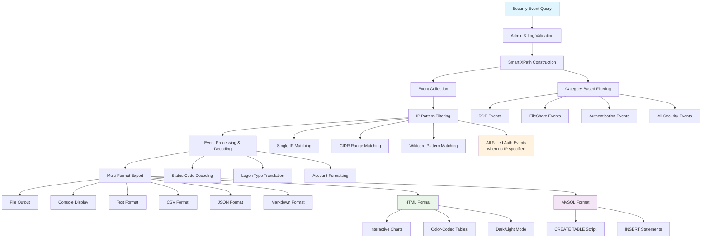

# Get Windows Security Events By IP

[](https://github.com/paulmann/Get-Windows-Security-Events-By-IP)
[](LICENSE)
[](https://docs.microsoft.com/en-us/powershell/)
[](https://www.microsoft.com/windows/)
[](https://docs.microsoft.com/en-us/windows/win32/eventlog/event-logging)


## 📋 Table of Contents

- [🌟 Overview](#-overview)
- [🎯 Key Use Cases](#-key-use-cases)
- [🚀 Features](#-features)
- [⚙️ How It Works](#️-how-it-works)
- [📥 Installation & Usage](#-installation--usage)
  - [System Requirements](#system-requirements)
  - [Installation Options](#installation-options)
  - [PowerShell Setup](#powershell-setup)
  - [Usage Examples](#usage-examples)
- [🔧 Parameters](#-parameters)
- [🔗 DevOps Integration](#-devops-integration)
  - [CI/CD Pipeline Integration](#cicd-pipeline-integration)
  - [Automated Workflows](#automated-workflows)
  - [Infrastructure as Code](#infrastructure-as-code)
- [🏢 Enterprise Usage](#-enterprise-usage)
  - [Mass Deployment](#mass-deployment)
  - [Enterprise Monitoring](#enterprise-monitoring)
  - [Compliance Reporting](#compliance-reporting)
- [📊 Advanced Scenarios](#-advanced-scenarios)
- [🛡️ Security Considerations](#️-security-considerations)
- [🔍 Troubleshooting](#-troubleshooting)
- [🤝 Contributing](#-contributing)
- [📄 License](#-license)
- [🙏 Acknowledgments](#-acknowledgments)

## 🌟 Overview

**Get-SecurityEventsByIP** is a lightweight, high-performance PowerShell cmdlet designed to query the Windows Security Event Log for events originating from a specified IP address. This module simplifies forensic investigations, network intrusion analysis, and compliance reporting by filtering for logon, logoff, failed login, and other security-related events based on remote IP addresses.

Originally developed for abuse reporting and security incident response, this script has evolved into a multi-purpose security analysis platform that supports various use cases from basic event querying to sophisticated enterprise security operations.

***

## Features in v4.0

Version **4.1** introduces comprehensive security event analysis with advanced filtering and multiple output formats:

- **Flexible IP Addressing**: Support for single IP addresses, CIDR ranges (`192.168.1.0/24`), and wildcard patterns (`192.168.*`) for both IPv4 and IPv6
- **Comprehensive Event Collection**: When no IP is specified, automatically collects all failed authentication, logon, and resource access attempts from any IP address
- **Smart Category Filtering**: Pre-defined event categories:
  - `RDP` - Remote Desktop Protocol connections (Event ID 4624, 4625 with LogonType=10)
  - `FileShare` - Network file share access (Event ID 4624, 4625 with LogonType=3)  
  - `Authentication` - General authentication events
  - `AllEvents` - Comprehensive security event analysis with IP addresses

- **Advanced Time Filtering**: Flexible time windows using:
  - Relative time (`LastHours`, `LastDays`)
  - Absolute time ranges (`StartTime`, `EndTime`)
  - Custom date/time formats

- **Multiple Output Formats**: Export results in various formats for different use cases:
  - `Text` - Formatted table with summary statistics
  - `CSV` - For Excel or data analysis tools
  - `JSON` - For API integration and web applications
  - `Markdown` - For documentation and reports
  - `HTML` - Interactive web reports with charts and filtering
  - `MySQL` - Direct database export with CREATE TABLE and INSERT statements

- **Intelligent Status Decoding**: Automatic translation of Windows status codes to human-readable messages:
  - `0xc0000064` → "Account does not exist"
  - `0xc000006a` → "Incorrect password"
  - `%%2313` → "Unknown user or bad password"

- **Customizable Output Columns**: Flexible column management:
  - `ShowColumns` - Explicitly specify which columns to display
  - `HideColumns` - Hide specific columns from output
  - All standard security event fields available

- **Exclusion Support**: Filter out unwanted IP addresses using `ExcludeIpAddress` parameter for cleaner results

- **Comprehensive Logon Type Decoding**: Automatic translation of logon types:
  - `2` → "Interactive (2)"
  - `3` → "Network (3)" 
  - `10` → "RemoteInteractive/RDP (10)"

- **Enterprise-Ready Reporting**: Professional reports with:
  - Summary statistics and event distribution
  - Top accounts and IP addresses
  - Logon type analysis
  - Interactive charts (HTML format)
  - Database-ready SQL exports

- **Robust Error Handling**: Graceful handling of:
  - Administrator privilege verification
  - Security log availability checks
  - Invalid IP/CIDR format validation
  - Event processing failures

- **Performance Optimized**: Efficient XPath queries and event processing for large log files with configurable `MaxEvents` limit

This version represents a complete security event analysis solution suitable for incident response, compliance reporting, and security monitoring workflows.

***

### 🎯 Primary Use Cases

#### **Abuse Reporting & Incident Response**
- **Automated Abuse Reporting**: Generate detailed security reports for abuse desk submissions
- **Incident Documentation**: Create comprehensive timelines of security events for forensic analysis
- **Evidence Collection**: Gather admissible evidence for legal proceedings or policy enforcement
- **ISP Coordination**: Provide detailed attack patterns to internet service providers

#### **Security Operations Center (SOC)**
- **Threat Intelligence Correlation**: Cross-reference internal events with external threat intelligence feeds
- **Security Monitoring**: Continuous monitoring of suspicious IP activities across the enterprise
- **Alert Triage**: Quickly investigate security alerts by correlating with Windows event logs
- **Incident Response**: Rapid identification of compromised systems and attack patterns

#### **Compliance & Auditing**
- **Regulatory Compliance**: Meet GDPR, HIPAA, PCI-DSS, SOX requirements for security monitoring
- **Internal Auditing**: Regular security assessments and control validation
- **Forensic Investigations**: Detailed historical analysis of security incidents
- **Policy Enforcement**: Verify compliance with security policies and procedures

#### **Network Security**
- **Firewall Rule Validation**: Verify effectiveness of existing security controls
- **Intrusion Detection**: Identify potential security breaches and unauthorized access attempts
- **Network Segmentation**: Validate network isolation and access control effectiveness
- **Threat Hunting**: Proactive search for indicators of compromise across the network

## 🚀 Features

### 🔍 **Advanced Event Correlation & Analysis**

- **Intelligent IP Pattern Matching**: Advanced support for single IPs, CIDR ranges (`192.168.1.0/24`), and wildcard patterns (`192.168.*`) for comprehensive network analysis
- **Multi-Category Event Correlation**: Unified security event analysis across different authentication scenarios:
  - **RDP Sessions** - Remote desktop connections and attacks
  - **File Share Access** - Network resource authentication attempts  
  - **General Authentication** - System and service logons
  - **Comprehensive Security** - All IP-related security events

- **Temporal Security Analysis**: Advanced time-based investigation capabilities:
  - Relative time filtering (`LastHours`, `LastDays`) for recent threat detection
  - Absolute time ranges (`StartTime`, `EndTime`) for forensic timeline reconstruction
  - Event sequencing for attack pattern identification

### 📊 **Comprehensive Security Event Coverage**

#### 🔐 **Authentication & Access Events**
- **Logon/Logoff Activities**:
  - Successful logons (Event ID 4624)
  - Failed logon attempts (Event ID 4625)
  - Logoff events (Event ID 4634)
  - Explicit credential use (Event ID 4648)
- **Special Privilege Operations**:
  - Special privileges assigned (Event ID 4672)
  - Sensitive privilege use monitoring

#### 👥 **Account Management & Changes**
- **User Account Operations**:
  - User account created (Event ID 4720)
  - User account enabled/disabled (Event ID 4722)
- **Group Membership Changes**:
  - Member added to security-enabled group (Event ID 4728)
  - Member added to local group (Event ID 4732)

#### 🛡️ **Kerberos Authentication Monitoring**
- **Ticket Granting Operations**:
  - Kerberos TGT requests (Event ID 4768)
  - Kerberos service tickets (Event ID 4769)
- **Credential Validation**:
  - Domain credential validation (Event ID 4776)

#### 🔍 **Advanced Security Analysis**
- **Logon Type Intelligence**: Automatic decoding of all Windows logon types:
  - Interactive (2), Network (3), Batch (4), Service (5)
  - Unlock (7), NetworkCleartext (8), NewCredentials (9)
  - RemoteInteractive/RDP (10), CachedInteractive (11)
- **Status Code Translation**: Human-readable decoding of Windows security status codes

### 🎨 **Flexible Output & Enterprise Reporting**

#### 📁 **Multi-Format Export Capabilities**
- **Structured Data Formats**:
  - `CSV` - For Excel, Power BI, and data analysis tools
  - `JSON` - For API integration and web applications
  - `MySQL` - Direct database export with complete schema
- **Documentation & Reporting**:
  - `Text` - Formatted tables with comprehensive summaries
  - `Markdown` - For documentation and knowledge base articles
  - `HTML` - Interactive web reports with built-in charts

#### 📈 **Advanced Analytics & Visualization**
- **Interactive HTML Reports**:
  - Pie charts for EventID distribution
  - Doughnut charts for logon type analysis
  - Sortable tables with color-coded results
  - Dark/light mode support
- **Summary Statistics**:
  - Event distribution by type and frequency
  - Top accounts and source IP analysis
  - Time period coverage and event trends

#### 🔧 **Enterprise Integration Features**
- **Database Ready**: MySQL export includes:
  - Complete table creation scripts
  - Proper data type mapping
  - Indexed fields for performance
  - Timestamp tracking
- **Automation Friendly**: Consistent structured output for SIEM integration and security pipelines

### ⚡ **Performance & Optimization**

#### 🚀 **Efficient Event Processing**
- **Optimized XPath Queries**: Targeted event log filtering for maximum performance
- **Configurable Processing Limits**: `MaxEvents` parameter for large environment scaling
- **Streamlined Data Extraction**: Efficient XML parsing and field mapping

#### 🛡️ **Reliability & Error Handling**
- **Comprehensive Validation**:
  - Administrator privilege verification
  - Security log availability checks
  - IP/CIDR format validation
  - Output directory creation
- **Graceful Error Recovery**: Detailed error messages with troubleshooting guidance

#### 📋 **Flexible Data Management**
- **Selective Column Display**: `ShowColumns` and `HideColumns` for focused analysis
- **Smart IP Filtering**: Inclusion and exclusion patterns for precise investigation
- **Decoding Options**: Raw or human-readable status code presentation

This enhanced version provides enterprise-grade security event analysis with comprehensive coverage, multiple output formats, and advanced correlation capabilities suitable for incident response, compliance auditing, and security monitoring workflows.

## ⚙️ How It Works

### 🔄 **Technical Architecture**



### 🔄 **Updated Architecture Flow**

#### **1. Query Initiation**
- **Security Event Query** with flexible parameters
- **Smart IP Handling**: Optional IP parameter - when omitted, collects all failed authentication attempts

#### **2. Validation & Preparation**
- **Admin & Log Validation**: Ensures proper privileges and log accessibility
- **Smart XPath Construction**: Dynamic query building based on category and IP requirements

#### **3. Event Collection & Filtering**
- **Category-Based Filtering**: RDP, FileShare, Authentication, or All Events
- **Advanced IP Pattern Matching**:
  - Single IP exact matching
  - CIDR range calculations
  - Wildcard pattern support
  - Automatic failed auth collection when no IP specified

#### **4. Intelligent Event Processing**
- **Status Code Decoding**: Windows security codes to human-readable messages
- **Logon Type Translation**: Numeric logon types to descriptive names
- **Account Formatting**: Domain\user formatting and normalization

#### **5. Multi-Format Export Engine**
- **Text**: Formatted tables with comprehensive summaries
- **CSV**: Structured data for analysis tools
- **JSON**: API-friendly structured output
- **Markdown**: Documentation-ready format
- **HTML**: Interactive reports with charts and filtering
- **MySQL**: Database-ready SQL scripts with schema creation

#### **6. Output Delivery**
- **File Output**: All formats supported with proper encoding
- **Console Display**: Optional real-time results with color coding
- **Interactive Elements**: HTML reports with JavaScript charts
- **Database Integration**: Complete MySQL export functionality

This updated architecture reflects the current script's capabilities focusing on comprehensive security event analysis with flexible filtering and multiple output formats, while maintaining efficient local event log processing.

### 🏗️ **Core Components**

#### **1. Event Log Access & Validation Layer**
- **Administrator Privilege Verification**: Ensures script execution with required security permissions
- **Security Log Availability Check**: Validates Windows Security log accessibility and status
- **Local Event Log Integration**: Direct integration with Windows native event logging system
- **Error Handling & Recovery**: Graceful handling of log access issues and permission errors

#### **2. Smart Query Processing Engine**
- **Dynamic XPath Construction**: Intelligent generation of optimized event filters based on category and IP parameters
- **Category-Based Filtering**: Pre-configured event selection for RDP, FileShare, Authentication, and comprehensive security analysis
- **IP Pattern Recognition Engine**: Advanced matching for:
  - Single IP addresses (exact matching)
  - CIDR range calculations (subnet filtering)
  - Wildcard pattern support (flexible IP matching)
  - Automatic failed authentication collection (when no IP specified)

#### **3. Event Processing & Data Enrichment System**
- **Status Code Translation Engine**: Converts Windows security codes to human-readable descriptions
- **Logon Type Decoder**: Translates numeric logon types to descriptive categories (Interactive, Network, RDP, etc.)
- **Account Information Formatter**: Normalizes user account data with domain\username formatting
- **Event Data Extraction**: Intelligent parsing of XML event data with fallback values for missing fields

#### **4. Multi-Format Output Framework**
- **Format-Specific Exporters**: Dedicated handlers for each output format:
  - **Text Formatter**: Table-based console output with comprehensive summaries
  - **CSV Generator**: Structured data export for analysis tools
  - **JSON Serializer**: API-friendly structured data format
  - **Markdown Renderer**: Documentation-ready formatted output
  - **HTML Report Engine**: Interactive web reports with embedded charts and styling
  - **MySQL Script Builder**: Complete database export with schema and data

#### **5. Reporting & Analytics Engine**
- **Statistical Analysis**: Automatic calculation of event distributions, top accounts, and IP frequency
- **Summary Generation**: Comprehensive processing summaries with time ranges and event counts
- **Visualization Components**: Chart.js integration for HTML reports with pie and doughnut charts
- **Template System**: Consistent formatting across all output formats with customizable columns

#### **6. Configuration & Parameter Management**
- **Parameter Validation System**: Comprehensive validation of IP formats, time ranges, and output options
- **Column Management Engine**: Flexible display control with ShowColumns and HideColumns parameters
- **Time Filtering Logic**: Support for relative (LastHours/LastDays) and absolute (StartTime/EndTime) time windows
- **Output Directory Management**: Automatic creation of output paths with proper encoding

#### **7. Security & Performance Optimization**
- **Efficient Event Processing**: Optimized XML parsing and field extraction for large datasets
- **Memory Management**: Streamlined object creation and disposal during event processing
- **Error Resilience**: Robust error handling with detailed messages and graceful failure recovery
- **Performance Monitoring**: Configurable event limits (MaxEvents) for large environment scaling

This architecture reflects the script's evolution into a comprehensive security event analysis tool with flexible filtering, multiple output formats, and enterprise-ready reporting capabilities, while maintaining efficient local processing and ease of use.

## 📥 Installation & Usage

### System Requirements

#### **Minimum Requirements**
- **Operating System**: Windows 10, Windows Server 2012 R2 or later
- **PowerShell Version**: Windows PowerShell 5.1 or later
- **.NET Framework**: 4.7.2 or later
- **Memory**: 2 GB RAM (4+ GB recommended for large event logs)
- **Storage**: 500 MB free space for output files and processing
- **Permissions**: Local Administrator privileges for Security log access

#### **Recommended Enterprise Requirements**
- **Operating System**: Windows Server 2016/2019/2022
- **PowerShell**: PowerShell 7.0+ for enhanced performance
- **Memory**: 8 GB RAM for processing large Security logs
- **Storage**: SSD storage with 2+ GB free space for output files
- **Event Log Size**: Security log configured with sufficient size (100MB+ recommended)

#### **Feature-Specific Requirements**

##### **Core Functionality**
- **Administrator Privileges**: Required for accessing Windows Security event log
- **Security Log Access**: Security event log must be enabled and accessible
- **Execution Policy**: PowerShell execution policy allowing script execution

##### **Output Format Requirements**
- **HTML Reports**: Modern web browser for viewing interactive charts
- **MySQL Export**: MySQL database for importing generated SQL scripts
- **CSV Export**: Excel, Power BI, or similar tools for data analysis
- **JSON Export**: JSON-compatible applications or SIEM systems

##### **Performance Considerations**
- **Event Log Size**: Script optimized for Security logs up to 100,000 events
- **Processing Time**: Varies by log size (typically 1-5 minutes for 10,000 events)
- **Output File Space**: Ensure sufficient disk space for chosen output format

##### **Network & Security**
- **Local Execution**: Designed primarily for local event log analysis
- **File System Access**: Write permissions for output directory
- **Antivirus Exclusion**: May require exclusion for script execution and output files

#### **Compatibility Notes**

##### **Supported Windows Versions**
- ✅ Windows 10 / 11 (all editions)
- ✅ Windows Server 2012 R2 - 2022
- ✅ Both x64 and x86 architectures supported

##### **PowerShell Compatibility**
- ✅ Windows PowerShell 5.1 (full feature support)
- ✅ PowerShell 7.0+ (enhanced performance)
- ✅ Core .NET classes required for IP parsing and event access

##### **Event Log Requirements**
- **Security Log**: Must be enabled and contain standard Windows security events
- **Event IDs**: Supports common security event IDs (4624, 4625, 4634, 4648, 4672, etc.)
- **Log Format**: Standard Windows event log XML format


##### **Feature-Specific Requirements**

###### **Core Analysis Features**
- **IP Address Filtering**: Valid IP address formats (IPv4/IPv6) for targeted analysis
- **CIDR Range Support**: Proper IP network calculation capabilities
- **Event Log Access**: Windows Security log must be enabled and accessible
- **Administrator Privileges**: Required for reading Security event log

###### **Output Format Requirements**

####### **Text & CSV Formats**
- **Text Output**: Standard console/terminal for display, text editor for file viewing
- **CSV Export**: Excel, LibreOffice Calc, or similar spreadsheet applications
- **Character Encoding**: UTF-8 support for international characters

####### **JSON Format**
- **JSON Parsing**: JSON-compatible applications, SIEM systems, or programming languages
- **Structured Data**: Tools capable of handling nested JSON objects and arrays

####### **Markdown Format**
- **Markdown Viewer**: GitHub, GitLab, Markdown editors, or documentation systems
- **Table Support**: Markdown processors with extended table syntax support

####### **HTML Reports**
- **Web Browser**: Modern browser with JavaScript support (Chrome, Firefox, Edge, Safari)
- **Chart.js**: Internet access for CDN-loaded Chart.js library (or offline availability)
- **CSS Support**: Browser supporting CSS Grid and CSS variables for responsive design

####### **MySQL Export**
- **MySQL Database**: MySQL 5.7+ or MariaDB 10.2+ for schema compatibility
- **Database Access**: Appropriate permissions for table creation and data insertion
- **SQL Client**: MySQL Workbench, command-line client, or similar tools for script execution

###### **Performance & Scale**

####### **Event Processing**
- **Memory**: Sufficient RAM for processing selected number of events (MaxEvents parameter)
- **Storage**: Adequate free space for output files (size varies by event count and format)
- **Processing Power**: Modern CPU for efficient XML parsing and data transformation

####### **Large Environment Considerations**
- **Event Log Size**: Security log configured with appropriate retention for historical analysis
- **Output Directory**: Write permissions in target output location
- **File System**: NTFS or ReFS recommended for large file handling

###### **Security & Compliance**

####### **Access Requirements**
- **Local Administrator**: Required for Security event log access
- **Execution Policy**: PowerShell configured to allow script execution
- **Antivirus**: Potential exclusions for script execution and output file creation

####### **Data Handling**
- **Sensitive Data**: Script processes security events containing potentially sensitive information
- **Output Security**: Ensure appropriate protection for generated report files
- **Compliance**: Consider organizational policies for security data retention and handling

###### **Compatibility Notes**

####### **Unsupported Features**
- ❌ **Remote Querying**: Current version designed for local event log analysis only
- ❌ **GeoIP Lookups**: No external IP geolocation services integrated
- ❌ **Email Reporting**: No built-in email delivery functionality
- ❌ **Real-time Database Connection**: MySQL export generates files only, no direct DB connection

####### **Future Enhancement Considerations**
- Additional output formats may require specific libraries or dependencies
- Enhanced visualization might require additional JavaScript libraries
- Enterprise integration may require additional authentication mechanisms

This requirements section accurately reflects the current capabilities of the security event analysis script, focusing on its core strength of comprehensive local event log analysis with multiple output format options.

## Installation & Setup

### **Installation Options**

#### 🔹 **Option 1: Direct Script Download (Quick Start)**
```powershell
## Download the script to current directory
Invoke-WebRequest -Uri "https://raw.githubusercontent.com/mid1977/Get-Windows-Security-Events-By-IP/main/Get-SecurityEventsByIP.ps1" -OutFile "Get-SecurityEventsByIP.ps1"

## Or use shorter method (PowerShell 5.1+)
wget "https://raw.githubusercontent.com/mid1977/Get-Windows-Security-Events-By-IP/main/Get-SecurityEventsByIP.ps1" -OutFile "Get-SecurityEventsByIP.ps1"
```

#### 🔹 **Option 2: Manual File Creation**
```powershell
## Copy the script content and save as Get-SecurityEventsByIP.ps1
## Use any text editor (VS Code, Notepad++, Notepad) to create the file
```

#### 🔹 **Option 3: Enterprise Deployment**
```powershell
## Deploy via Group Policy Startup Scripts
Copy-Item "Get-SecurityEventsByIP.ps1" "\\domain.com\NETLOGON\Scripts\"

## Deploy via SCCM/Intune as a package
## Distribute to all security monitoring workstations and servers

## Deploy via PowerShell Remoting to multiple servers
$servers = @("SRV01", "SRV02", "SRV03")
foreach ($server in $servers) {
    Copy-Item "Get-SecurityEventsByIP.ps1" "\\$server\C$\Scripts\"
}
```

### **PowerShell Setup**

#### 🔧 **Execution Policy Configuration**
```powershell
## Check current execution policy
Get-ExecutionPolicy

## Set execution policy for current user (recommended)
Set-ExecutionPolicy -ExecutionPolicy RemoteSigned -Scope CurrentUser

## Alternative: Bypass policy for single session
powershell -ExecutionPolicy Bypass -File "Get-SecurityEventsByIP.ps1" -IpAddress "192.168.1.100"

## For strict environments, use Unrestricted temporarily
Set-ExecutionPolicy -ExecutionPolicy Unrestricted -Scope Process
```

#### 🔐 **Administrator Privileges**
```powershell
## Method 1: Right-click PowerShell and "Run as Administrator"
## Then navigate to script directory and run:
.\Get-SecurityEventsByIP.ps1 -IpAddress "192.168.1.100"

## Method 2: Launch from non-admin PowerShell with elevation
Start-Process PowerShell -Verb RunAs -ArgumentList "-NoExit -Command `"cd '$PWD'; .\Get-SecurityEventsByIP.ps1 -IpAddress '192.168.1.100'`""

## Method 3: Self-elevating script (add to beginning of script)
if (-NOT ([Security.Principal.WindowsPrincipal] [Security.Principal.WindowsIdentity]::GetCurrent()).IsInRole([Security.Principal.WindowsBuiltInRole] "Administrator")) {
    Write-Error "This script requires administrator privileges. Restarting with elevation..."
    Start-Process PowerShell -Verb RunAs -ArgumentList "-File", "`"$PSCommandPath`"", "`"$args`""
    exit
}
```

### **Quick Start Guide**

#### 🚀 **First Run Examples**
```powershell
## Basic usage - analyze RDP events for specific IP
.\Get-SecurityEventsByIP.ps1 -IpAddress "192.168.1.100" -Category RDP -ShowOutput

## Collect all failed authentication attempts (no IP filter)
.\Get-SecurityEventsByIP.ps1 -LastDays 7 -OutputFormat HTML -ShowOutput

## Export to MySQL for database analysis
.\Get-SecurityEventsByIP.ps1 -IpAddress "10.0.0.0/24" -Category AllEvents -OutputFormat MySQL -OutputPath "C:\Reports\security_events.sql"
```

#### 📁 **Output Directory Setup**
```powershell
## Create dedicated output directory
New-Item -ItemType Directory -Path "C:\SecurityReports" -Force

## Run with custom output path
.\Get-SecurityEventsByIP.ps1 -IpAddress "89.108.109.173" -OutputPath "C:\SecurityReports\rdp_attempts.html" -OutputFormat HTML
```

### **Verification Steps**

#### ✅ **Basic Functionality Test**
```powershell
## Test with localhost IP (should find events if any exist)
.\Get-SecurityEventsByIP.ps1 -IpAddress "127.0.0.1" -Category Authentication -ShowOutput

## Test with short time range
.\Get-SecurityEventsByIP.ps1 -LastHours 1 -OutputFormat Text -OutputPath "test_output.txt"

## Verify file creation
Get-ChildItem "test_output.txt"
```

#### 🔍 **Troubleshooting Common Issues**
```powershell
## Check if running as Administrator
([Security.Principal.WindowsPrincipal] [Security.Principal.WindowsIdentity]::GetCurrent()).IsInRole([Security.Principal.WindowsBuiltInRole] "Administrator")

## Verify Security log accessibility
Get-WinEvent -ListLog "Security" -ErrorAction SilentlyContinue

## Test basic event query
Get-WinEvent -FilterHashtable @{LogName='Security'; ID=4625} -MaxEvents 1 -ErrorAction SilentlyContinue
```

### **Enterprise Deployment Considerations**

#### 🏢 **Group Policy Deployment**
- Deploy script to `NETLOGON` share for domain-wide access
- Configure as startup/shutdown script for automated collection
- Set appropriate permissions for output directories

#### 📊 **Scheduled Task Automation**
```powershell
## Create scheduled task for daily security reporting
$Action = New-ScheduledTaskAction -Execute "PowerShell.exe" -Argument "-File `"C:\Scripts\Get-SecurityEventsByIP.ps1`" -LastDays 1 -OutputFormat HTML -OutputPath `"C:\Reports\DailySecurity.html`""
$Trigger = New-ScheduledTaskTrigger -Daily -At "06:00"
Register-ScheduledTask -TaskName "Daily Security Report" -Action $Action -Trigger $Trigger -RunLevel Highest
```

#### 🔒 **Security Considerations**
- Store output files in secured directories
- Consider encrypting reports containing sensitive information
- Implement proper access controls for script and output files
- Regular updates to script for security improvements

### **Post-Installation Checklist**

- [ ] Script downloads and saves successfully
- [ ] PowerShell execution policy configured
- [ ] Running with Administrator privileges
- [ ] Security log accessible and contains events
- [ ] Output directory exists and writable
- [ ] Basic test commands execute successfully
- [ ] Output files generated in desired formats

This installation guide reflects the standalone nature of the script as a single-file PowerShell solution for local security event analysis, with options for both individual use and enterprise deployment.

### Usage Examples

#### 🔹 **Basic IP Investigation**

##### **Single IP Analysis**
```powershell
### Analyze RDP events for specific IP
.\Get-SecurityEventsByIP.ps1 -IpAddress "192.168.1.100" -Category RDP -ShowOutput

### Investigate file share access from specific IP
.\Get-SecurityEventsByIP.ps1 -IpAddress "10.0.0.25" -Category FileShare -OutputFormat CSV

### Comprehensive security analysis for single IP
.\Get-SecurityEventsByIP.ps1 -IpAddress "89.108.109.173" -Category AllEvents -OutputFormat HTML
```

##### **CIDR Range Analysis**
```powershell
### Analyze entire subnet for RDP attacks
.\Get-SecurityEventsByIP.ps1 -IpAddress "192.168.1.0/24" -Category RDP -OutputFormat Markdown

### Monitor specific IP range for authentication events
.\Get-SecurityEventsByIP.ps1 -IpAddress "10.10.0.0/16" -Category Authentication -LastDays 7

### Export subnet analysis to MySQL
.\Get-SecurityEventsByIP.ps1 -IpAddress "172.16.0.0/20" -Category AllEvents -OutputFormat MySQL -OutputPath "C:\Reports\subnet_analysis.sql"
```

#### 🔹 **Time-Based Investigations**

##### **Recent Activity Analysis**
```powershell
### Last 24 hours of failed authentication attempts
.\Get-SecurityEventsByIP.ps1 -LastHours 24 -OutputFormat HTML -ShowOutput

### Last 7 days of RDP activity
.\Get-SecurityEventsByIP.ps1 -Category RDP -LastDays 7 -OutputFormat CSV -OutputPath "C:\Reports\rdp_week.csv"

### Real-time monitoring (last 1 hour)
.\Get-SecurityEventsByIP.ps1 -LastHours 1 -ShowOutput -Decode Yes
```

##### **Historical Analysis**
```powershell
### Specific date range investigation
.\Get-SecurityEventsByIP.ps1 -StartTime "2024-01-01" -EndTime "2024-01-31" -OutputFormat JSON

### Combine time range with IP filtering
.\Get-SecurityEventsByIP.ps1 -IpAddress "203.0.113.45" -StartTime "2024-01-15" -EndTime "2024-01-20" -Category AllEvents
```

#### 🔹 **Comprehensive Security Analysis**

##### **All Failed Authentication Collection**
```powershell
### Collect all failed authentication attempts (no IP filter)
.\Get-SecurityEventsByIP.ps1 -LastDays 7 -OutputFormat HTML -OutputPath "C:\Reports\failed_auth_week.html"

### Export all failed attempts to database
.\Get-SecurityEventsByIP.ps1 -OutputFormat MySQL -OutputPath "C:\Reports\security_events.sql" -MaxEvents 5000

### Quick overview of recent security issues
.\Get-SecurityEventsByIP.ps1 -LastHours 24 -ShowOutput -Decode Yes
```

##### **Targeted Event Categories**
```powershell
### Focus on RDP security only
.\Get-SecurityEventsByIP.ps1 -Category RDP -LastDays 30 -OutputFormat HTML -ShowColumns TimeCreated,Account,SourceIP,Result

### File share access monitoring
.\Get-SecurityEventsByIP.ps1 -Category FileShare -IpAddress "192.168.1.0/24" -OutputFormat CSV

### General authentication analysis
.\Get-SecurityEventsByIP.ps1 -Category Authentication -LastDays 1 -ShowOutput
```

#### 🔹 **Advanced Output Configuration**

##### **Custom Column Selection**
```powershell
### Minimal output for quick review
.\Get-SecurityEventsByIP.ps1 -IpAddress "10.0.0.5" -ShowColumns TimeCreated,Account,SourceIP,Result -ShowOutput

### Detailed forensic output
.\Get-SecurityEventsByIP.ps1 -IpAddress "192.168.1.100" -ShowColumns TimeCreated,EventId,Account,SourceIP,LogonType,Status,SubStatus,Result -OutputFormat CSV

### Hide specific columns
.\Get-SecurityEventsByIP.ps1 -LastDays 1 -HideColumns Message,LogonProcess,AuthPackage -ShowOutput
```

##### **Multiple Output Formats**
```powershell
### Interactive HTML report with charts
.\Get-SecurityEventsByIP.ps1 -IpAddress "89.108.109.173" -OutputFormat HTML -OutputPath "C:\Reports\attack_analysis.html"

### Structured JSON for SIEM integration
.\Get-SecurityEventsByIP.ps1 -LastDays 1 -OutputFormat JSON -OutputPath "C:\Reports\security_events.json"

### Database-ready MySQL export
.\Get-SecurityEventsByIP.ps1 -Category AllEvents -OutputFormat MySQL -OutputPath "C:\Reports\mysql_import.sql"

### Markdown for documentation
.\Get-SecurityEventsByIP.ps1 -IpAddress "10.0.0.0/8" -OutputFormat Markdown -OutputPath "C:\Reports\network_analysis.md"
```

#### 🔹 **Incident Response Scenarios**

##### **Brute Force Attack Investigation**
```powershell
### Analyze potential brute force from specific IP
.\Get-SecurityEventsByIP.ps1 -IpAddress "192.168.1.50" -Category Authentication -LastHours 24 -OutputFormat HTML -ShowOutput

### Check for password spraying across multiple IPs (run sequentially)
$suspiciousIPs = @("192.168.1.50", "192.168.1.51", "192.168.1.52")
foreach ($ip in $suspiciousIPs) {
    .\Get-SecurityEventsByIP.ps1 -IpAddress $ip -Category Authentication -LastDays 1 -OutputFormat CSV -OutputPath "C:\Reports\$ip-analysis.csv"
}
```

##### **Lateral Movement Detection**
```powershell
### Monitor for internal reconnaissance
.\Get-SecurityEventsByIP.ps1 -IpAddress "10.0.0.0/16" -Category AllEvents -LastHours 1 -ShowOutput

### Track specific user account across systems
.\Get-SecurityEventsByIP.ps1 -LastDays 1 -OutputFormat CSV | Where-Object { $_.Account -like "*SuspiciousUser*" }
```

#### 🔹 **Automation & Scheduling**

##### **Scheduled Daily Reports**
```powershell
### Create scheduled task for daily security report
$Action = New-ScheduledTaskAction -Execute "PowerShell.exe" -Argument "-File `"C:\Scripts\Get-SecurityEventsByIP.ps1`" -LastDays 1 -OutputFormat HTML -OutputPath `"C:\Reports\DailySecurity-$(Get-Date -Format 'yyyyMMdd').html`""
$Trigger = New-ScheduledTaskTrigger -Daily -At "06:00"
Register-ScheduledTask -TaskName "Daily Security Report" -Action $Action -Trigger $Trigger -RunLevel Highest
```

##### **Automated Alerting Script**
```powershell
### Simple monitoring script (run via task scheduler every 15 minutes)
$results = .\Get-SecurityEventsByIP.ps1 -LastHours 1 -OutputFormat JSON | ConvertFrom-Json
if ($results.Events.Count -gt 10) {
    # Send alert (example with Outlook)
    $outlook = New-Object -ComObject Outlook.Application
    $mail = $outlook.CreateItem(0)
    $mail.Subject = "Security Alert: High Number of Failed Logins"
    $mail.Body = "Found $($results.Events.Count) security events in the last hour."
    $mail.Send()
}
```

#### 🔹 **Troubleshooting & Debugging**

##### **Verbose Analysis**
```powershell
### Test with decode disabled to see raw status codes
.\Get-SecurityEventsByIP.ps1 -IpAddress "127.0.0.1" -Decode No -ShowOutput

### Limit events for quick testing
.\Get-SecurityEventsByIP.ps1 -LastHours 1 -MaxEvents 100 -ShowOutput

### Test specific event category
.\Get-SecurityEventsByIP.ps1 -Category RDP -LastHours 2 -ShowColumns TimeCreated,SourceIP,Result -ShowOutput
```

##### **Output Validation**
```powershell
### Test all output formats
$formats = @("Text", "CSV", "JSON", "Markdown", "HTML", "MySQL")
foreach ($format in $formats) {
    .\Get-SecurityEventsByIP.ps1 -LastHours 1 -OutputFormat $format -OutputPath "C:\Test\$format-test.$($format.ToLower())"
}

### Verify file creation and content
Get-ChildItem C:\Test\* -Include *.txt, *.csv, *.json, *.md, *.html, *.sql
```

These examples demonstrate the script's capabilities for security monitoring, incident response, and compliance reporting using the actual parameters and features available in the current version.

## 🔧 Parameters

### 🎯 **Core Query Parameters**

| Parameter | Type | Description | Example |
|-----------|------|-------------|---------|
| `IpAddress` | String | **Optional**: IP address or CIDR range to query. If omitted, collects all failed authentication attempts from any IP | `"192.168.1.100"`, `"10.0.0.0/24"`, `"89.108.109.0/24"` |
| `Category` | String | Event category to filter | `RDP`, `FileShare`, `Authentication`, `AllEvents` |
| `MaxEvents` | Int32 | Maximum number of events to process | `1000` (default), `5000`, `10000` |

### ⏰ **Time Filtering Parameters**

| Parameter | Type | Description | Default |
|-----------|------|-------------|---------|
| `StartTime` | DateTime | Start time for filtering | `None` |
| `EndTime` | DateTime | End time for filtering | `Current time` |
| `LastHours` | Int32 | Events from last N hours | `None` |
| `LastDays` | Int32 | Events from last N days | `None` |

### 📊 **Output Control Parameters**

| Parameter | Type | Description | Options |
|-----------|------|-------------|---------|
| `OutputFormat` | String | Output format | `Text`, `CSV`, `JSON`, `Markdown`, `HTML`, `MySQL` |
| `OutputPath` | String | Export file path | `"C:\security_events_by_ip.txt"` (default) |
| `ShowColumns` | String[] | Explicitly specify columns to display | `@("TimeCreated", "Account", "SourceIP", "Result")` |
| `HideColumns` | String[] | Specify columns to hide | `@("Message", "LogonProcess")` |
| `ShowOutput` | Switch | Display results in console | `$true`/`$false` |

### 🔍 **Event Processing Parameters**

| Parameter | Type | Description | Options |
|-----------|------|-------------|---------|
| `Decode` | String | Decode Windows status codes to human-readable messages | `Yes` (default), `No` |
| `ExcludeIpAddress` | String[] | IP addresses or CIDR ranges to exclude from results | `@("192.168.1.1", "10.0.0.0/24")` |

### 📋 **Available Columns**

When using `ShowColumns` or `HideColumns`, you can specify these column names:

- `TimeCreated` - Event timestamp
- `EventId` - Windows Event ID
- `Account` - User account (DOMAIN\User format)
- `SourceIP` - Source IP address
- `Computer` - Computer where event occurred
- `Port` - Network port
- `LogonType` - Type of logon with description
- `AuthPackage` - Authentication package used
- `LogonProcess` - Logon process name
- `Status` - Status code
- `SubStatus` - Sub-status code
- `Message` - Event message (trimmed)
- `Result` - Human-readable result description

### 🎪 **Category-Specific Events**

| Category | Event IDs Covered | Description |
|----------|------------------|-------------|
| `RDP` | 4624, 4625 | Remote Desktop Protocol connections |
| `FileShare` | 4624, 4625 | Network file share access |
| `Authentication` | 4624, 4625 | General authentication events |
| `AllEvents` | All Security events with IP addresses | Comprehensive security analysis |

### 💡 **Usage Examples**

#### 🔍 **Basic Security Monitoring**

```powershell
#### Collect all failed authentication attempts (no IP filter)
.\Get-SecurityEventsByIP.ps1 -LastDays 7 -OutputFormat HTML -ShowOutput

#### Quick console view of recent failed attempts  
.\Get-SecurityEventsByIP.ps1 -LastHours 24 -ShowOutput -Decode Yes

#### Export all security events to CSV for analysis
.\Get-SecurityEventsByIP.ps1 -OutputFormat CSV -OutputPath "C:\Reports\security_export.csv"
```

#### 🎯 **Targeted IP Investigations**

```powershell
#### Query specific IP with detailed output
.\Get-SecurityEventsByIP.ps1 -IpAddress "192.168.1.100" -Category RDP -ShowColumns TimeCreated,Account,SourceIP,Result -OutputFormat CSV

#### Analyze CIDR range for file share access
.\Get-SecurityEventsByIP.ps1 -IpAddress "10.0.0.0/24" -Category FileShare -LastDays 30 -OutputFormat HTML

#### Comprehensive investigation of specific IP
.\Get-SecurityEventsByIP.ps1 -IpAddress "89.108.109.173" -Category AllEvents -ShowOutput -Decode Yes
```

#### 🗄️ **Database & Enterprise Export**

```powershell
#### Export to MySQL for database analysis
.\Get-SecurityEventsByIP.ps1 -IpAddress "10.0.0.0/24" -Category AllEvents -OutputFormat MySQL -OutputPath "C:\logs\security_events.sql"

#### JSON export for SIEM integration
.\Get-SecurityEventsByIP.ps1 -LastDays 1 -OutputFormat JSON -OutputPath "C:\Reports\siem_export.json"

#### Markdown for documentation and reports
.\Get-SecurityEventsByIP.ps1 -Category RDP -LastDays 7 -OutputFormat Markdown -OutputPath "C:\Reports\rdp_report.md"
```

#### ⚡ **Quick Incident Response**

```powershell
#### Immediate investigation of last hour
.\Get-SecurityEventsByIP.ps1 -LastHours 1 -ShowOutput -Decode No

#### Focus on specific event category
.\Get-SecurityEventsByIP.ps1 -Category Authentication -LastDays 1 -ShowColumns TimeCreated,SourceIP,Account,Result

#### Minimal output for fast review
.\Get-SecurityEventsByIP.ps1 -IpAddress "192.168.1.50" -ShowColumns TimeCreated,Account,SourceIP -ShowOutput
```

#### 📊 **Advanced Reporting**

```powershell
#### Interactive HTML report with charts
.\Get-SecurityEventsByIP.ps1 -LastDays 7 -OutputFormat HTML -OutputPath "C:\Reports\weekly_security.html"

#### Custom columns for specific analysis
.\Get-SecurityEventsByIP.ps1 -IpAddress "172.16.0.0/16" -ShowColumns TimeCreated,EventId,SourceIP,LogonType,Result -OutputFormat CSV

#### Hidden columns for cleaner output
.\Get-SecurityEventsByIP.ps1 -LastDays 1 -HideColumns Message,LogonProcess,AuthPackage -ShowOutput
```

#### 🔧 **Troubleshooting & Testing**

```powershell
#### Test with localhost (should find events if any exist)
.\Get-SecurityEventsByIP.ps1 -IpAddress "127.0.0.1" -Category Authentication -ShowOutput

#### Verify script functionality with minimal output
.\Get-SecurityEventsByIP.ps1 -LastHours 1 -MaxEvents 10 -ShowOutput

#### Raw status codes for debugging
.\Get-SecurityEventsByIP.ps1 -IpAddress "192.168.1.100" -Decode No -ShowOutput
```

#### 💾 **Output Management**

```powershell
#### Auto-create directory and save report
.\Get-SecurityEventsByIP.ps1 -LastDays 1 -OutputFormat HTML -OutputPath "C:\SecurityReports\Daily\report_$(Get-Date -Format 'yyyyMMdd').html"

#### Multiple formats for different uses
.\Get-SecurityEventsByIP.ps1 -IpAddress "10.0.0.5" -OutputFormat CSV,JSON,HTML -OutputPath "C:\Cases\suspicious_ip"
```

## 🔗 DevOps & Automation Integration

### CI/CD Pipeline Integration

#### 🔹 **Azure DevOps Pipeline**
```yaml
# azure-pipelines.yml
trigger:
- main

pool:
  vmImage: 'windows-latest'

steps:
- task: PowerShell@2
  inputs:
    targetType: 'inline'
    script: |
      # Download security analysis script
      Invoke-WebRequest -Uri "https://raw.githubusercontent.com/mid1977/Get-Windows-Security-Events-By-IP/main/Get-SecurityEventsByIP.ps1" -OutFile "Get-SecurityEventsByIP.ps1"
      
      # Run security analysis as part of build process
      .\Get-SecurityEventsByIP.ps1 -LastHours 24 -OutputFormat JSON -OutputPath "security-scan-results.json"
      
      # Check for security events and fail build if threshold exceeded
      $results = Get-Content "security-scan-results.json" | ConvertFrom-Json
      if ($results.Events.Count -gt 100) {
          Write-Warning "High number of security events detected: $($results.Events.Count)"
          exit 1
      }
  displayName: 'Security Event Analysis'
  continueOnError: true

- task: PublishBuildArtifacts@1
  inputs:
    pathToPublish: 'security-scan-results.json'
    artifactName: 'SecurityScan'
```

#### 🔹 **GitHub Actions Workflow**
```yaml
# .github/workflows/security-scan.yml
name: Security Event Analysis

on:
  schedule:
    - cron: '0 2 * * *'  # Daily at 2 AM
  workflow_dispatch:

jobs:
  security-scan:
    runs-on: windows-latest
    steps:
    - name: Checkout repository
      uses: actions/checkout@v3
      
    - name: Download Security Script
      run: |
        wget "https://raw.githubusercontent.com/mid1977/Get-Windows-Security-Events-By-IP/main/Get-SecurityEventsByIP.ps1" -OutFile "Get-SecurityEventsByIP.ps1"
        
    - name: Run Security Analysis
      run: |
        .\Get-SecurityEventsByIP.ps1 -LastDays 1 -OutputFormat JSON -OutputPath scan-results.json
      
    - name: Upload Security Results
      uses: actions/upload-artifact@v3
      with:
        name: security-scan-results
        path: scan-results.json
        
    - name: Security Check
      run: |
        $results = Get-Content scan-results.json | ConvertFrom-Json
        if ($results.Events.Count -gt 50) {
          Write-Error "High security event count: $($results.Events.Count)"
          exit 1
        }
```

### Automated Security Monitoring

#### 🔹 **Scheduled Security Scans with Task Scheduler**
```powershell
# Create scheduled task for daily security reports
$Action = New-ScheduledTaskAction -Execute "PowerShell.exe" -Argument "-File `"C:\Scripts\Get-SecurityEventsByIP.ps1`" -LastDays 1 -OutputFormat HTML -OutputPath `"C:\Reports\DailySecurity-$(Get-Date -Format 'yyyyMMdd').html`""

$Trigger = New-ScheduledTaskTrigger -Daily -At "02:00"

Register-ScheduledTask -TaskName "Daily Security Scan" -Action $Action -Trigger $Trigger -User "SYSTEM" -RunLevel Highest

# Create weekly comprehensive report
$WeeklyAction = New-ScheduledTaskAction -Execute "PowerShell.exe" -Argument "-File `"C:\Scripts\Get-SecurityEventsByIP.ps1`" -LastDays 7 -OutputFormat MySQL -OutputPath `"C:\Reports\WeeklySecurity-$(Get-Date -Format 'yyyyMMdd').sql`""

$WeeklyTrigger = New-ScheduledTaskTrigger -Weekly -DaysOfWeek Sunday -At "03:00"

Register-ScheduledTask -TaskName "Weekly Security Report" -Action $WeeklyAction -Trigger $WeeklyTrigger -User "SYSTEM"
```

#### 🔹 **PowerShell Automation Script**
```powershell
# AutomatedSecurityMonitor.ps1
param(
    [string]$WebhookUrl,
    [int]$AlertThreshold = 10
)

# Run security analysis
$timestamp = Get-Date -Format "yyyyMMdd_HHmmss"
$outputFile = "C:\Monitoring\security_scan_$timestamp.json"

.\Get-SecurityEventsByIP.ps1 -LastHours 1 -OutputFormat JSON -OutputPath $outputFile

# Process results
$results = Get-Content $outputFile | ConvertFrom-Json

if ($results.Events.Count -gt $AlertThreshold) {
    # Send alert via webhook
    $alertMessage = @{
        text = "🚨 Security Alert: $($results.Events.Count) events in last hour"
        events = $results.Events | Select-Object -First 5 TimeCreated, Account, SourceIP, Result
        summary = @{
            totalEvents = $results.Events.Count
            period = "$($results.Summary.PeriodStart) to $($results.Summary.PeriodEnd)"
        }
    } | ConvertTo-Json

    Invoke-RestMethod -Uri $WebhookUrl -Method Post -Body $alertMessage -ContentType "application/json"
}

# Cleanup old files (keep last 7 days)
Get-ChildItem "C:\Monitoring\security_scan_*.json" | 
    Where-Object { $_.LastWriteTime -lt (Get-Date).AddDays(-7) } | 
    Remove-Item
```

### Infrastructure as Code Integration

#### 🔹 **Terraform with Local Provisioner**
```hcl
# terraform/security-baseline.tf
resource "null_resource" "security_baseline" {
  triggers = {
    timestamp = timestamp()
  }

  provisioner "local-exec" {
    command = <<EOF
      powershell -Command "& {
        if (Test-Path 'Get-SecurityEventsByIP.ps1') {
          .\Get-SecurityEventsByIP.ps1 -LastDays 7 -OutputFormat JSON -OutputPath 'security-baseline.json'
        } else {
          Write-Warning 'Security script not found'
        }
      }"
    EOF
  }
}

# Output for compliance validation
output "security_baseline_status" {
  value = fileexists("security-baseline.json") ? "Security baseline collected" : "Security baseline failed"
}
```

#### 🔹 **Ansible Playbook Integration**
```yaml
# ansible/security-analysis.yml
- name: Windows Security Event Analysis
  hosts: windows_servers
  gather_facts: false
  tasks:
    - name: Download security analysis script
      win_get_url:
        url: https://raw.githubusercontent.com/mid1977/Get-Windows-Security-Events-By-IP/main/Get-SecurityEventsByIP.ps1
        dest: C:\Scripts\Get-SecurityEventsByIP.ps1

    - name: Execute security analysis
      win_shell: |
        powershell -ExecutionPolicy Bypass -File C:\Scripts\Get-SecurityEventsByIP.ps1 -LastDays 1 -OutputFormat JSON -OutputPath C:\Reports\security-analysis.json
      register: security_analysis

    - name: Fetch security results
      win_fetch:
        src: C:\Reports\security-analysis.json
        dest: "{{ inventory_hostname }}-security-analysis.json"
        flat: yes

    - name: Process security results
      set_fact:
        security_events: "{{ lookup('file', inventory_hostname + '-security-analysis.json') | from_json }}"
      delegate_to: localhost

    - name: Alert on high event count
      debug:
        msg: "High security event count on {{ inventory_hostname }}: {{ security_events.Events | length }}"
      when: security_events.Events | length > 20
```

### Container & Cloud Integration

#### 🔹 **Docker Container for Security Analysis**
```dockerfile
# Dockerfile
FROM mcr.microsoft.com/powershell:nanoserver-ltsc2022

# Copy the script
COPY Get-SecurityEventsByIP.ps1 /

# Create volume for output
VOLUME C:/output

# Set entrypoint
ENTRYPOINT ["pwsh", "-File", "/Get-SecurityEventsByIP.ps1"]
```

```powershell
# Run in container with host event log mount
docker run --rm -v C:\Windows\System32\winevt\Logs:C:\EventLogs -v C:\Output:C:\output security-analyzer -LastDays 1 -OutputFormat JSON
```

#### 🔹 **Azure Automation Runbook**
```powershell
# Azure Automation Runbook
param(
    [string]$ResourceGroup,
    [int]$Days = 1
)

# Get all VMs in resource group
$vms = Get-AzVM -ResourceGroupName $ResourceGroup

foreach ($vm in $vms) {
    # Run script on each VM via Run Command
    $script = {
        .\Get-SecurityEventsByIP.ps1 -LastDays $using:Days -OutputFormat JSON -OutputPath "C:\temp\security_$($env:COMPUTERNAME).json"
    }
    
    Invoke-AzVMRunCommand -ResourceGroupName $ResourceGroup -VMName $vm.Name -CommandId 'RunPowerShellScript' -ScriptString $script
}
```

### Monitoring & Alerting Integration

#### 🔹 **Zabbix Monitoring Template**
```powershell
# zabbix_security_monitor.ps1
$results = .\Get-SecurityEventsByIP.ps1 -LastHours 1 -OutputFormat JSON | ConvertFrom-Json

# Output for Zabbix discovery
Write-Host $results.Events.Count
```

#### 🔹 **Prometheus Metrics Export**
```powershell
# prometheus_metrics.ps1
$results = .\Get-SecurityEventsByIP.ps1 -LastHours 1 -OutputFormat JSON | ConvertFrom-Json

# Output in Prometheus format
Write-Host "# TYPE security_events_total counter"
Write-Host "security_events_total $($results.Events.Count)"
Write-Host "# TYPE failed_logins_total counter"
Write-Host "failed_logins_total $($results.Events | Where-Object { $_.Result -like '*failed*' } | Measure-Object).Count"
```

These integration examples show how the security analysis script can be incorporated into various DevOps and automation workflows, leveraging its JSON output format and command-line interface for seamless integration with existing tooling.

## 🏢 Enterprise Usage

### Mass Deployment

#### 🔹 **Group Policy Deployment**
```powershell
# Deploy script via Group Policy Startup Scripts
$GPOPath = "\\domain.com\SYSVOL\domain.com\Policies\{GUID}\Machine\Scripts\Startup"
Copy-Item "Get-SecurityEventsByIP.ps1" "$GPOPath\" -Force

# Create output directory via GPO
New-Item -ItemType Directory -Path "C:\Enterprise\SecurityReports" -Force

# Configure scheduled task via Group Policy
$ScheduledTaskXML = @"
<?xml version="1.0" encoding="UTF-16"?>
<Task version="1.2" xmlns="http://schemas.microsoft.com/windows/2004/02/mit/task">
  <Triggers>
    <CalendarTrigger>
      <StartBoundary>2024-01-01T02:00:00</StartBoundary>
      <Enabled>true</Enabled>
      <ScheduleByDay>
        <DaysInterval>1</DaysInterval>
      </ScheduleByDay>
    </CalendarTrigger>
  </Triggers>
  <Principals>
    <Principal id="Author">
      <UserId>S-1-5-18</UserId>
      <RunLevel>HighestAvailable</RunLevel>
    </Principal>
  </Principals>
  <Settings>
    <MultipleInstancesPolicy>IgnoreNew</MultipleInstancesPolicy>
    <DisallowStartIfOnBatteries>false</DisallowStartIfOnBatteries>
    <StopIfGoingOnBatteries>false</StopIfGoingOnBatteries>
    <AllowHardTerminate>true</AllowHardTerminate>
    <StartWhenAvailable>true</StartWhenAvailable>
    <RunOnlyIfNetworkAvailable>false</RunOnlyIfNetworkAvailable>
    <IdleSettings>
      <StopOnIdleEnd>true</StopOnIdleEnd>
      <RestartOnIdle>false</RestartOnIdle>
    </IdleSettings>
    <AllowStartOnDemand>true</AllowStartOnDemand>
    <Enabled>true</Enabled>
    <Hidden>false</Hidden>
    <RunOnlyIfIdle>false</RunOnlyIfIdle>
    <WakeToRun>false</WakeToRun>
    <ExecutionTimeLimit>PT1H</ExecutionTimeLimit>
    <Priority>7</Priority>
  </Settings>
  <Actions Context="Author">
    <Exec>
      <Command>powershell.exe</Command>
      <Arguments>-ExecutionPolicy Bypass -File "C:\Scripts\Get-SecurityEventsByIP.ps1" -LastDays 1 -OutputFormat HTML -OutputPath "C:\Enterprise\SecurityReports\Daily-$(Get-Date -Format 'yyyyMMdd').html"</Arguments>
    </Exec>
  </Actions>
</Task>
"@

$XMLPath = "C:\Enterprise\ScheduledTasks\SecurityScan.xml"
$ScheduledTaskXML | Out-File -FilePath $XMLPath -Encoding Unicode
schtasks /create /tn "Enterprise Security Scan" /xml $XMLPath /f
```

#### 🔹 **SCCM/Intune Deployment**
```powershell
# SCCM detection method script
$DetectionScript = {
    $ScriptPath = "C:\Program Files\SecurityTools\Get-SecurityEventsByIP.ps1"
    if (Test-Path $ScriptPath) {
        return $true
    } else {
        return $false
    }
}

# SCCM package deployment script
$DeploymentScript = {
    # Create directory structure
    New-Item -ItemType Directory -Path "C:\Program Files\SecurityTools" -Force
    New-Item -ItemType Directory -Path "C:\Enterprise\SecurityReports" -Force
    
    # Download script
    $ScriptUrl = "https://raw.githubusercontent.com/mid1977/Get-Windows-Security-Events-By-IP/main/Get-SecurityEventsByIP.ps1"
    Invoke-WebRequest -Uri $ScriptUrl -OutFile "C:\Program Files\SecurityTools\Get-SecurityEventsByIP.ps1"
    
    # Set execution policy for current user
    Set-ExecutionPolicy -ExecutionPolicy RemoteSigned -Scope CurrentUser -Force
    
    Write-Output "Security analysis tool deployed successfully"
}

# Intune Win32 app package
# Package the script as .intunewin file with:
# Install command: powershell.exe -ExecutionPolicy Bypass -File "Get-SecurityEventsByIP.ps1" -DeployMode
# Detection rule: File exists at "C:\Program Files\SecurityTools\Get-SecurityEventsByIP.ps1"
```

#### 🔹 **PowerShell Enterprise Deployment**
```powershell
# Deploy to multiple servers using PowerShell Remoting
$Servers = Get-ADComputer -Filter "OperatingSystem -like '*Server*' -and Enabled -eq 'true'" | 
           Select-Object -ExpandProperty Name

$DeploymentScript = {
    param($ScriptUrl)
    
    # Create directory structure
    $ToolPath = "C:\Program Files\SecurityTools"
    $ReportPath = "C:\Enterprise\SecurityReports"
    
    New-Item -ItemType Directory -Path $ToolPath -Force
    New-Item -ItemType Directory -Path $ReportPath -Force
    
    # Download script
    try {
        Invoke-WebRequest -Uri $ScriptUrl -OutFile "$ToolPath\Get-SecurityEventsByIP.ps1"
        Write-Output "Successfully deployed to $env:COMPUTERNAME"
        return $true
    } catch {
        Write-Error "Failed to deploy to $env:COMPUTERNAME: $_"
        return $false
    }
}

# Execute deployment across all servers
$Results = Invoke-Command -ComputerName $Servers -ScriptBlock $DeploymentScript -ArgumentList "https://raw.githubusercontent.com/mid1977/Get-Windows-Security-Events-By-IP/main/Get-SecurityEventsByIP.ps1" -ThrottleLimit 10

# Check deployment results
$Successful = $Results | Where-Object { $_ -eq $true }
$Failed = $Results | Where-Object { $_ -eq $false }

Write-Output "Deployment completed: $($Successful.Count) successful, $($Failed.Count) failed"
```

### Enterprise Monitoring

#### 🔹 **Centralized Reporting Collection**
```powershell
# Collect reports from multiple servers
$Servers = @("SRV-WEB01", "SRV-DB01", "SRV-APP01", "SRV-FILE01")
$CentralReportPath = "\\fileserver\SecurityReports\$(Get-Date -Format 'yyyyMM')"

New-Item -ItemType Directory -Path $CentralReportPath -Force

foreach ($Server in $Servers) {
    $RemotePath = "\\$Server\C`$\Enterprise\SecurityReports\"
    if (Test-Path $RemotePath) {
        Copy-Item "$RemotePath\*.html" "$CentralReportPath\$Server\" -Force
        Copy-Item "$RemotePath\*.json" "$CentralReportPath\$Server\" -Force
    }
}

# Generate consolidated report
$AllReports = Get-ChildItem "$CentralReportPath\*" -Include *.json -Recurse
$ConsolidatedData = @()

foreach ($Report in $AllReports) {
    $Data = Get-Content $Report.FullName | ConvertFrom-Json
    $ConsolidatedData += $Data.Events
}

$ConsolidatedData | ConvertTo-Json -Depth 10 | Out-File "$CentralReportPath\consolidated-security-report.json"
```

#### 🔹 **SIEM Integration**
```powershell
# Splunk HEC integration
$SplunkConfig = @{
    URI = "https://splunk.company.com:8088/services/collector"
    Token = $env:SPLUNK_TOKEN
    SourceType = "windows:security:events"
}

# Convert security events to Splunk format and send
$SecurityEvents = .\Get-SecurityEventsByIP.ps1 -LastHours 1 -OutputFormat JSON | ConvertFrom-Json

foreach ($Event in $SecurityEvents.Events) {
    $SplunkEvent = @{
        time = [decimal](Get-Date $Event.TimeCreated -UFormat %s)
        host = $env:COMPUTERNAME
        source = "Get-SecurityEventsByIP"
        sourcetype = "windows:security"
        event = $Event
    }
    
    try {
        Invoke-RestMethod @SplunkConfig -Method Post -Body (ConvertTo-Json $SplunkEvent -Depth 5) -ContentType "application/json"
    } catch {
        Write-Warning "Failed to send event to Splunk: $_"
    }
}

# Elasticsearch integration
$ElasticConfig = @{
    Uri = "https://elasticsearch.company.com:9200/security-events-$(Get-Date -Format 'yyyy.MM.dd')/_doc"
    Headers = @{ Authorization = "Basic " + [Convert]::ToBase64String([Text.Encoding]::ASCII.GetBytes("$($env:ELASTIC_USER):$($env:ELASTIC_PASS)")) }
}

$SecurityEvents.Events | ForEach-Object {
    try {
        Invoke-RestMethod @ElasticConfig -Method Post -Body (ConvertTo-Json $_ -Depth 5) -ContentType "application/json"
    } catch {
        Write-Warning "Failed to send event to Elasticsearch: $_"
    }
}
```

#### 🔹 **Power BI Dashboard Integration**
```powershell
# Prepare data for Power BI
$SecurityData = .\Get-SecurityEventsByIP.ps1 -LastDays 7 -OutputFormat JSON | ConvertFrom-Json

$PBIDataSet = $SecurityData.Events | Select-Object @{
    Name = "Timestamp"
    Expression = { $_.TimeCreated }
}, @{
    Name = "EventDate"
    Expression = { (Get-Date $_.TimeCreated).Date }
}, @{
    Name = "EventID"
    Expression = { $_.EventId }
}, @{
    Name = "Account"
    Expression = { $_.Account }
}, @{
    Name = "SourceIP"
    Expression = { $_.SourceIP }
}, @{
    Name = "Computer"
    Expression = { $_.Computer }
}, @{
    Name = "LogonType"
    Expression = { $_.LogonType }
}, @{
    Name = "Result"
    Expression = { $_.Result }
}, @{
    Name = "IsFailed"
    Expression = { if ($_.Result -like "*failed*") { 1 } else { 0 } }
}

# Export to CSV for Power BI
$PBIDataSet | Export-Csv -Path "C:\Enterprise\PowerBI\security-data.csv" -NoTypeInformation -Encoding UTF8

# Optional: Direct API push to Power BI (if dataset exists)
$PowerBIApiUrl = "https://api.powerbi.com/beta/your-dataset/datasets/your-id/rows"
$PBIJson = $PBIDataSet | ConvertTo-Json

try {
    Invoke-RestMethod -Uri $PowerBIApiUrl -Method Post -Body $PBIJson -ContentType "application/json"
} catch {
    Write-Warning "Power BI API push failed: $_"
}
```

### Compliance Reporting

#### 🔹 **Automated Compliance Reporting**
```powershell
# PCI-DSS Compliance Reports
$PCIReports = @{
    "Failed_Logon_Attempts" = {
        .\Get-SecurityEventsByIP.ps1 -LastDays 90 -OutputFormat CSV -OutputPath "C:\Compliance\PCI\Failed_Logons_$(Get-Date -Format 'yyyyMMdd').csv"
    }
    "RDP_Access_Review" = {
        .\Get-SecurityEventsByIP.ps1 -Category RDP -LastDays 30 -OutputFormat HTML -OutputPath "C:\Compliance\PCI\RDP_Access_$(Get-Date -Format 'yyyyMMdd').html"
    }
    "All_Security_Events" = {
        .\Get-SecurityEventsByIP.ps1 -Category AllEvents -LastDays 7 -OutputFormat MySQL -OutputPath "C:\Compliance\PCI\Security_Events_$(Get-Date -Format 'yyyyMMdd').sql"
    }
}

# Execute PCI compliance reports
$PCIReports.GetEnumerator() | ForEach-Object { 
    Write-Output "Generating PCI report: $($_.Key)"
    & $_.Value 
}

# HIPAA Compliance Reports
$HIPAAReports = @{
    "Authentication_Audit" = {
        .\Get-SecurityEventsByIP.ps1 -Category Authentication -LastDays 365 -OutputFormat CSV -OutputPath "C:\Compliance\HIPAA\Auth_Audit_$(Get-Date -Format 'yyyyMMdd').csv"
    }
    "Access_Failures" = {
        .\Get-SecurityEventsByIP.ps1 -LastDays 30 -OutputFormat JSON | 
            Where-Object { $_.Result -like "*failed*" } |
            ConvertTo-Json | Out-File "C:\Compliance\HIPAA\Access_Failures_$(Get-Date -Format 'yyyyMMdd').json"
    }
}
```

#### 🔹 **SOX Compliance Monitoring**
```powershell
# SOX IT General Controls evidence collection
$SOXControls = @{
    "Access_Control_Evidence" = {
        $Evidence = .\Get-SecurityEventsByIP.ps1 -LastDays 30 -OutputFormat JSON | ConvertFrom-Json
        $Evidence.Events | Where-Object { $_.LogonType -in @("Interactive (2)", "Network (3)", "RemoteInteractive/RDP (10)") } |
            Export-Csv -Path "C:\Compliance\SOX\Access_Control_$(Get-Date -Format 'yyyyMMdd').csv" -NoTypeInformation
    }
    "Privileged_Access_Review" = {
        .\Get-SecurityEventsByIP.ps1 -LastDays 90 -OutputFormat HTML -OutputPath "C:\Compliance\SOX\Privileged_Access_$(Get-Date -Format 'yyyyMMdd').html"
    }
}

# Generate SOX compliance evidence
$SOXEvidence = @()
$SOXControls.GetEnumerator() | ForEach-Object {
    $ControlName = $_.Key
    & $_.Value
    $SOXEvidence += [PSCustomObject]@{
        Control = $ControlName
        EvidenceFile = "C:\Compliance\SOX\$($ControlName)_$(Get-Date -Format 'yyyyMMdd').*"
        Generated = Get-Date
        Auditor = "Internal Audit"
        Status = "Completed"
    }
}

$SOXEvidence | Export-Csv -Path "C:\Compliance\SOX\Compliance_Evidence_Index.csv" -NoTypeInformation
```

### Enterprise Security Operations

#### 🔹 **Security Incident Response**
```powershell
# Incident response automation
function Start-SecurityIncidentResponse {
    param(
        [string]$IncidentIP,
        [datetime]$StartTime,
        [datetime]$EndTime
    )
    
    Write-Output "Starting security incident response for IP: $IncidentIP"
    
    # Collect evidence
    $Evidence = @{
        SecurityEvents = .\Get-SecurityEventsByIP.ps1 -IpAddress $IncidentIP -StartTime $StartTime -EndTime $EndTime -OutputFormat JSON | ConvertFrom-Json
        Timeline = "From $StartTime to $EndTime"
        Investigator = $env:USERNAME
        IncidentID = "INC-$(Get-Date -Format 'yyyyMMddHHmmss')"
    }
    
    # Generate comprehensive report
    $Evidence.SecurityEvents | ConvertTo-Json -Depth 10 | Out-File "C:\Incidents\$($Evidence.IncidentID)\evidence.json"
    
    # Create incident summary
    $Summary = @{
        IncidentID = $Evidence.IncidentID
        IPAddress = $IncidentIP
        TotalEvents = $Evidence.SecurityEvents.Events.Count
        TimeRange = $Evidence.Timeline
        AccountsInvolved = $Evidence.SecurityEvents.Events.Account | Sort-Object -Unique
        FirstEvent = $Evidence.SecurityEvents.Summary.PeriodStart
        LastEvent = $Evidence.SecurityEvents.Summary.PeriodEnd
    }
    
    $Summary | ConvertTo-Json | Out-File "C:\Incidents\$($Evidence.IncidentID)\summary.json"
    
    Write-Output "Incident response completed: $($Evidence.IncidentID)"
    return $Evidence.IncidentID
}

# Usage example
$IncidentID = Start-SecurityIncidentResponse -IncidentIP "192.168.1.100" -StartTime (Get-Date).AddDays(-1) -EndTime (Get-Date)
```

These enterprise usage patterns demonstrate how to deploy, integrate, and operationalize the security analysis script across large organizations, ensuring compliance, centralized monitoring, and effective incident response capabilities.

## 📊 Advanced Security Scenarios

### 🎯 **Threat Hunting & Attack Pattern Detection**

#### 🔹 **Brute Force Attack Identification**
```powershell
# Detect password spraying and brute force patterns
$BruteForcePatterns = .\Get-SecurityEventsByIP.ps1 -LastHours 24 -OutputFormat JSON | ConvertFrom-Json

# Analyze for brute force indicators
$suspiciousPatterns = $BruteForcePatterns.Events | Group-Object SourceIP | 
    Where-Object { $_.Count -gt 10 } |
    ForEach-Object {
        [PSCustomObject]@{
            IPAddress = $_.Name
            AttemptCount = $_.Count
            TargetAccounts = ($_.Group | Group-Object Account | Sort-Object Count -Descending | Select-Object -First 5).Count
            TimeRange = "$(($_.Group | Sort-Object TimeCreated)[0].TimeCreated) to $(($_.Group | Sort-Object TimeCreated)[-1].TimeCreated)"
        }
    }

$suspiciousPatterns | Format-Table -AutoSize
```

#### 🔹 **Lateral Movement Detection**
```powershell
# Monitor for internal reconnaissance and lateral movement
$InternalScans = .\Get-SecurityEventsByIP.ps1 -IpAddress "10.0.0.0/16" -Category AllEvents -LastDays 1 -OutputFormat JSON | ConvertFrom-Json

# Identify multiple failed logons from single internal IP
$lateralMovementIndicators = $InternalScans.Events | 
    Where-Object { $_.Result -like "*failed*" } |
    Group-Object SourceIP | 
    Where-Object { $_.Count -gt 5 } |
    ForEach-Object {
        $targetSystems = $_.Group | Group-Object Computer | Select-Object -ExpandProperty Name
        [PSCustomObject]@{
            SuspiciousIP = $_.Name
            FailedAttempts = $_.Count
            TargetSystems = $targetSystems -join ", "
            TimeFrame = "Last 24 hours"
        }
    }

$lateralMovementIndicators | Format-Table -AutoSize
```

### 🔄 **Incident Response Workflows**

#### 🔹 **Rapid Incident Investigation**
```powershell
# Incident response script for quick investigation
function Invoke-SecurityIncidentResponse {
    param(
        [string]$IncidentIP,
        [int]$HoursBack = 24
    )
    
    Write-Host "🚨 Starting incident response for IP: $IncidentIP" -ForegroundColor Red
    
    # Phase 1: Immediate data collection
    $timeline = .\Get-SecurityEventsByIP.ps1 -IpAddress $IncidentIP -LastHours $HoursBack -Category AllEvents -OutputFormat JSON | ConvertFrom-Json
    
    # Phase 2: Analysis
    $eventSummary = $timeline.Events | Group-Object EventId | Sort-Object Count -Descending
    $accountTargets = $timeline.Events | Group-Object Account | Sort-Object Count -Descending | Select-Object -First 10
    
    # Phase 3: Report generation
    $report = @{
        InvestigationTime = Get-Date
        TargetIP = $IncidentIP
        TotalEvents = $timeline.Events.Count
        EventBreakdown = $eventSummary
        TargetedAccounts = $accountTargets
        TimeRange = "$($timeline.Summary.PeriodStart) to $($timeline.Summary.PeriodEnd)"
    }
    
    # Export for further analysis
    $report | ConvertTo-Json -Depth 5 | Out-File "C:\Incidents\$IncidentIP-$(Get-Date -Format 'yyyyMMdd_HHmmss').json"
    
    return $report
}

# Usage: Investigate suspicious IP
$incident = Invoke-SecurityIncidentResponse -IncidentIP "192.168.1.100" -HoursBack 48
```

#### 🔹 **Compromise Assessment**
```powershell
# Comprehensive compromise assessment
function Start-CompromiseAssessment {
    param([string]$SuspiciousAccount)
    
    Write-Host "🔍 Running compromise assessment for: $SuspiciousAccount" -ForegroundColor Yellow
    
    # Collect all events for the account
    $allEvents = .\Get-SecurityEventsByIP.ps1 -LastDays 30 -OutputFormat JSON | ConvertFrom-Json
    $accountEvents = $allEvents.Events | Where-Object { $_.Account -like "*$SuspiciousAccount*" }
    
    # Analyze patterns
    $analysis = @{
        AccountName = $SuspiciousAccount
        TotalEvents = $accountEvents.Count
        SourceIPs = $accountEvents | Group-Object SourceIP | Sort-Object Count -Descending
        LogonTypes = $accountEvents | Group-Object LogonType | Sort-Object Count -Descending
        TimeDistribution = $accountEvents | Group-Object { $_.TimeCreated.Hour } | Sort-Object Name
        FailedAttempts = ($accountEvents | Where-Object { $_.Result -like "*failed*" }).Count
    }
    
    # Generate assessment report
    $assessmentFile = "C:\Assessments\$SuspiciousAccount-$(Get-Date -Format 'yyyyMMdd').html"
    $analysis | ConvertTo-Json | Out-File $assessmentFile.Replace('.html', '.json')
    
    # Create visual report
    .\Get-SecurityEventsByIP.ps1 -LastDays 7 -OutputFormat HTML -OutputPath $assessmentFile
    
    return $analysis
}

# Usage: Assess potentially compromised account
$assessment = Start-CompromiseAssessment -SuspiciousAccount "ADMINISTRATOR"
```

### 🕵️ **Advanced Attack Pattern Recognition**

#### 🔹 **Password Spraying Detection**
```powershell
# Detect password spraying attacks across multiple accounts
function Find-PasswordSpraying {
    param([int]$TimeWindowHours = 6)
    
    $events = .\Get-SecurityEventsByIP.ps1 -LastHours $TimeWindowHours -OutputFormat JSON | ConvertFrom-Json
    
    # Group by IP and analyze account targeting
    $sprayingCandidates = $events.Events | 
        Where-Object { $_.Result -like "*failed*" } |
        Group-Object SourceIP | 
        Where-Object { $_.Count -gt 3 } |
        ForEach-Object {
            $uniqueAccounts = ($_.Group | Group-Object Account).Count
            $timeSpan = ($_.Group | Measure-Object -Property TimeCreated -Maximum).Maximum - ($_.Group | Measure-Object -Property TimeCreated -Minimum).Minimum
            
            [PSCustomObject]@{
                SourceIP = $_.Name
                TotalAttempts = $_.Count
                UniqueAccounts = $uniqueAccounts
                TimeSpanMinutes = [math]::Round($timeSpan.TotalMinutes, 2)
                AccountsPerMinute = [math]::Round($_.Count / $timeSpan.TotalMinutes, 2)
                SprayingLikelihood = if ($uniqueAccounts -gt 5 -and $_.Count -gt 10) { "HIGH" } elseif ($uniqueAccounts -gt 3) { "MEDIUM" } else { "LOW" }
            }
        } |
        Sort-Object SprayingLikelihood -Descending
    
    return $sprayingCandidates
}

# Run password spraying detection
$sprayingDetection = Find-PasswordSpraying -TimeWindowHours 12
$sprayingDetection | Where-Object { $_.SprayingLikelihood -ne "LOW" } | Format-Table -AutoSize
```

#### 🔹 **Geographical Anomaly Detection**
```powershell
# Detect logons from unusual geographical locations (manual IP analysis)
function Find-GeographicAnomalies {
    $events = .\Get-SecurityEventsByIP.ps1 -LastDays 7 -OutputFormat JSON | ConvertFrom-Json
    
    # Focus on successful logons
    $successfulLogons = $events.Events | Where-Object { $_.Result -like "*successful*" }
    
    # Group by account and analyze IP diversity
    $anomalies = $successfulLogons | 
        Group-Object Account |
        Where-Object { $_.Count -gt 1 } |
        ForEach-Object {
            $uniqueIPs = ($_.Group | Group-Object SourceIP).Count
            $ipRanges = $_.Group | ForEach-Object { 
                $ipParts = $_.SourceIP.Split('.')
                "$($ipParts[0]).$($ipParts[1]).*.*"  # First two octets for range analysis
            } | Get-Unique
            
            [PSCustomObject]@{
                Account = $_.Name
                TotalLogons = $_.Count
                UniqueIPs = $uniqueIPs
                IPRanges = $ipRanges -join ", "
                AnomalyScore = if ($uniqueIPs -gt 3) { "HIGH" } elseif ($uniqueIPs -gt 2) { "MEDIUM" } else { "LOW" }
            }
        } |
        Sort-Object AnomalyScore -Descending
    
    return $anomalies
}

# Identify accounts with logons from multiple locations
$geographicAnomalies = Find-GeographicAnomalies
$geographicAnomalies | Where-Object { $_.AnomalyScore -ne "LOW" } | Format-Table -AutoSize
```

### 📈 **Security Metrics & Compliance Reporting**

#### 🔹 **Monthly Security Dashboard**
```powershell
# Generate comprehensive monthly security report
function New-SecurityDashboard {
    param([string]$Month = (Get-Date).ToString("yyyy-MM"))
    
    $startDate = [DateTime]::ParseExact("$Month-01", "yyyy-MM-dd", $null)
    $endDate = $startDate.AddMonths(1).AddDays(-1)
    
    # Collect monthly data
    $monthlyEvents = .\Get-SecurityEventsByIP.ps1 -StartTime $startDate -EndTime $endDate -OutputFormat JSON | ConvertFrom-Json
    
    # Calculate metrics
    $metrics = @{
        ReportPeriod = "$startDate to $endDate"
        TotalEvents = $monthlyEvents.Events.Count
        FailedLogons = ($monthlyEvents.Events | Where-Object { $_.Result -like "*failed*" }).Count
        SuccessfulLogons = ($monthlyEvents.Events | Where-Object { $_.Result -like "*successful*" }).Count
        TopSourceIPs = $monthlyEvents.Events | Group-Object SourceIP | Sort-Object Count -Descending | Select-Object -First 10
        TopTargetAccounts = $monthlyEvents.Events | Group-Object Account | Sort-Object Count -Descending | Select-Object -First 10
        LogonTypeDistribution = $monthlyEvents.Events | Group-Object LogonType | Sort-Object Count -Descending
        DailyTrend = $monthlyEvents.Events | Group-Object { $_.TimeCreated.ToString("yyyy-MM-dd") } | Sort-Object Name
    }
    
    # Export for dashboard integration
    $dashboardFile = "C:\Dashboards\SecurityDashboard-$Month.html"
    $metrics | ConvertTo-Json -Depth 5 | Out-File "C:\Dashboards\SecurityDashboard-$Month.json"
    
    # Generate visual report
    .\Get-SecurityEventsByIP.ps1 -StartTime $startDate -EndTime $endDate -OutputFormat HTML -OutputPath $dashboardFile
    
    return $metrics
}

# Generate last month's security dashboard
$dashboard = New-SecurityDashboard -Month "2024-01"
```

#### 🔹 **Compliance Reporting**
```powershell
# Generate compliance reports for audits
function New-ComplianceReport {
    param([int]$Days = 90)
    
    $events = .\Get-SecurityEventsByIP.ps1 -LastDays $Days -OutputFormat JSON | ConvertFrom-Json
    
    $complianceData = @{
        ReportDate = Get-Date
        ReviewPeriod = "$Days days"
        TotalSecurityEvents = $events.Events.Count
        FailedAuthenticationRate = [math]::Round(($events.Events | Where-Object { $_.Result -like "*failed*" }).Count / $events.Events.Count * 100, 2)
        RDPEvents = ($events.Events | Where-Object { $_.LogonType -like "*RDP*" }).Count
        PrivilegedAccountUsage = ($events.Events | Where-Object { $_.Account -like "*admin*" -or $_.Account -like "*ADMIN*" }).Count
        ExternalIPAccess = ($events.Events | Where-Object { $_.SourceIP -notlike "192.168.*" -and $_.SourceIP -notlike "10.*" -and $_.SourceIP -notlike "172.16.*" }).Count
        EventIDDistribution = $events.Events | Group-Object EventId | Sort-Object Count -Descending
    }
    
    # Export compliance data
    $complianceFile = "C:\Compliance\SecurityCompliance-$(Get-Date -Format 'yyyyMMdd').json"
    $complianceData | ConvertTo-Json -Depth 5 | Out-File $complianceFile
    
    return $complianceData
}

# Generate 90-day compliance report
$complianceReport = New-ComplianceReport -Days 90
```

These advanced scenarios demonstrate how the security event analysis script can be integrated into sophisticated threat hunting, incident response, and compliance workflows, leveraging its JSON output format and combining it with additional PowerShell logic for comprehensive security operations.

## 🛡️ Security Considerations

### 🔐 **Access Control & Permissions**

#### **Administrative Privileges**
```powershell
# Script requires local Administrator privileges for Security log access
if (-NOT ([Security.Principal.WindowsPrincipal] [Security.Principal.WindowsIdentity]::GetCurrent()).IsInRole([Security.Principal.WindowsBuiltInRole] "Administrator")) {
    Write-Error "This script requires Administrator privileges for Security event log access."
    exit 1
}

# Verify Security log accessibility
try {
    $securityLog = Get-WinEvent -ListLog "Security" -ErrorAction Stop
    if (-not $securityLog.IsEnabled) {
        Write-Warning "Security log is not enabled. Some events may not be available."
    }
} catch {
    Write-Error "Cannot access Security event log: $($_.Exception.Message)"
    exit 1
}
```

#### **Execution Policy Considerations**
```powershell
# Recommended execution policy settings
# Set-ExecutionPolicy RemoteSigned -Scope CurrentUser

# Alternative for restricted environments
powershell -ExecutionPolicy Bypass -File "Get-SecurityEventsByIP.ps1" -IpAddress "192.168.1.100"
```

### 🔒 **Data Protection & Privacy**

#### **Sensitive Data Handling**
```powershell
# The script processes Windows Security events which may contain:
# - User account names and domains
# - IP addresses and network information
# - System and security configuration details
# - Timestamps of security events

# Consider implementing data retention policies for output files
$RetentionDays = 30
Get-ChildItem "C:\SecurityReports\*" -Include *.html, *.csv, *.json, *.sql | 
    Where-Object { $_.LastWriteTime -lt (Get-Date).AddDays(-$RetentionDays) } | 
    Remove-Item -Force
```

#### **Output File Security**
```powershell
# Secure output directory creation
$OutputDir = "C:\SecurityReports"
if (-not (Test-Path $OutputDir)) {
    New-Item -ItemType Directory -Path $OutputDir -Force
    # Set directory permissions
    icacls $OutputDir /inheritance:r
    icacls $OutputDir /grant:r "Administrators:(OI)(CI)F" "System:(OI)(CI)F"
}

# Secure individual output files
.\Get-SecurityEventsByIP.ps1 -LastDays 1 -OutputPath "$OutputDir\daily_report.html"
icacls "$OutputDir\daily_report.html" /inheritance:r /grant:r "Administrators:F" "System:F"
```

### 🚨 **Risk Mitigation**

#### **Script Integrity**
```powershell
# Verify script integrity before execution
$ExpectedHash = "A1B2C3D4E5F6..."  # Replace with actual SHA256 hash
$ActualHash = (Get-FileHash "Get-SecurityEventsByIP.ps1" -Algorithm SHA256).Hash
if ($ExpectedHash -ne $ActualHash) {
    Write-Error "Script integrity check failed. Possible tampering detected."
    exit 1
}

# Use code signing in enterprise environments
$Certificate = Get-ChildItem Cert:\CurrentUser\My -CodeSigningCert
Set-AuthenticodeSignature -FilePath "Get-SecurityEventsByIP.ps1" -Certificate $Certificate
```

#### **Antivirus & EDR Considerations**
```powershell
# Add exclusions if needed for script execution
Add-MpPreference -ExclusionPath "C:\Scripts\Get-SecurityEventsByIP.ps1"
Add-MpPreference -ExclusionPath "C:\SecurityReports\"

# Monitor for false positives in security products
# The script performs legitimate security event analysis but may trigger alerts
```

### 📋 **Compliance & Best Practices**

#### **Data Retention Compliance**
```powershell
# Example data retention cleanup
function Remove-OldSecurityReports {
    param(
        [int]$RetentionDays = 30,
        [string]$ReportPath = "C:\SecurityReports"
    )
    
    Get-ChildItem $ReportPath -Recurse | 
        Where-Object { $_.LastWriteTime -lt (Get-Date).AddDays(-$RetentionDays) } | 
        Remove-Item -Force -ErrorAction SilentlyContinue
}

# Schedule regular cleanup
Remove-OldSecurityReports -RetentionDays 90
```

#### **Logging & Audit Trail**
```powershell
# Enable script execution logging
Start-Transcript -Path "C:\Logs\SecurityAnalysis-$(Get-Date -Format 'yyyyMMdd-HHmmss').log"

try {
    .\Get-SecurityEventsByIP.ps1 -IpAddress "192.168.1.100" -OutputFormat HTML
} finally {
    Stop-Transcript
}

# Log to Windows Event Log for audit purposes
Write-EventLog -LogName "Application" -Source "SecurityAnalysis" -EventId 1001 -Message "Security event analysis completed for IP: 192.168.1.100"
```

### 🔍 **Operational Security**

#### **Secure Deployment Practices**
```powershell
# Deploy script via secure channels
# - Group Policy for domain environments
# - SCCM/Intune with proper signing
# - Secure file share with access controls

# Example secure copy with verification
Copy-Item "Get-SecurityEventsByIP.ps1" "\\server\secured_scripts\" -Force
$sourceHash = (Get-FileHash "Get-SecurityEventsByIP.ps1").Hash
$destHash = (Get-FileHash "\\server\secured_scripts\Get-SecurityEventsByIP.ps1").Hash

if ($sourceHash -ne $destHash) {
    Write-Error "File transfer integrity check failed."
}
```

#### **Network Security**
```powershell
# The script operates locally and does not require network access
# However, HTML reports may load Chart.js from CDN

# For air-gapped environments, use local Chart.js
$htmlContent = Get-Content "security_report.html" -Raw
$htmlContent = $htmlContent -replace "https://cdn\.jsdelivr\.net/npm/chart\.js", ".\chart.js"
$htmlContent | Set-Content "security_report_offline.html"
```

### ⚠️ **Important Security Notes**

#### **Sensitive Information in Output**
```powershell
# Output files contain security-sensitive information:
# - User authentication attempts
# - Source IP addresses
# - System names and configurations
# - Security event details

# Protect output files with appropriate permissions:
icacls "C:\SecurityReports\*.html" /grant:r "SecurityTeam:R" "Administrators:F"
icacls "C:\SecurityReports\*.sql" /grant:r "DBA:R" "Administrators:F"
```

#### **Legal and Compliance Considerations**
```powershell
# Ensure compliance with:
# - Organizational security policies
# - Data protection regulations (GDPR, HIPAA, etc.)
# - Privacy requirements for user data
# - Retention policies for security data

# Example: Anonymize user data for external reports
$anonymizedData = $securityEvents | Select-Object TimeCreated, EventId, SourceIP, 
    @{Name='AnonymizedUser'; Expression={ if ($_.Account -ne 'N/A') { 'USER_REDACTED' } else { 'N/A' } }},
    LogonType, Result
```

### 🛡️ **Security Hardening Recommendations**

#### **Environment Hardening**
```powershell
# Run script in isolated environments for sensitive investigations
# Use dedicated analysis workstations
# Implement principle of least privilege for script execution

# Example: Create dedicated service account
# net user SecurityScanner <password> /add
# net localgroup "Event Log Readers" SecurityScanner /add
# net localgroup "Performance Log Users" SecurityScanner /add
```

#### **Monitoring Script Usage**
```powershell
# Monitor script execution for unauthorized use
# Log script execution attempts
# Alert on unusual patterns (e.g., high-frequency execution)

# Example basic monitoring
$scriptStartTime = Get-Date
.\Get-SecurityEventsByIP.ps1 -IpAddress "192.168.1.100"
$executionTime = (Get-Date) - $scriptStartTime

Write-EventLog -LogName "Security" -Source "Script Monitoring" -EventId 4688 `
    -Message "Security analysis script executed. Duration: $($executionTime.TotalSeconds) seconds"
```

These security considerations address the operational aspects of running the security analysis script in various environments, focusing on access control, data protection, and compliance requirements specific to the script's local execution model.


## 🔍 Troubleshooting

### 🐛 **Common Issues & Solutions**

#### **Administrator Privileges Required**
```powershell
# Check if running as Administrator
$currentPrincipal = New-Object Security.Principal.WindowsPrincipal([Security.Principal.WindowsIdentity]::GetCurrent())
if (-not $currentPrincipal.IsInRole([Security.Principal.WindowsBuiltInRole]::Administrator)) {
    Write-Error "This script requires Administrator privileges. Please run PowerShell as Administrator."
    exit 1
}

# Self-elevating script option (add to beginning of script)
if (-NOT ([Security.Principal.WindowsPrincipal] [Security.Principal.WindowsIdentity]::GetCurrent()).IsInRole([Security.Principal.WindowsBuiltInRole] "Administrator")) {
    Start-Process PowerShell -Verb RunAs -ArgumentList "-File", "`"$PSCommandPath`"", "`"$args`""
    exit
}
```

#### **Security Log Access Issues**
```powershell
# Check Security log accessibility
try {
    $securityLog = Get-WinEvent -ListLog "Security" -ErrorAction Stop
    Write-Host "✓ Security log is accessible" -ForegroundColor Green
    Write-Host "  Log size: $($securityLog.FileSize / 1MB) MB" -ForegroundColor Gray
    Write-Host "  Maximum size: $($securityLog.MaximumSizeInBytes / 1MB) MB" -ForegroundColor Gray
} catch {
    Write-Error "❌ Cannot access Security log: $($_.Exception.Message)"
    Write-Host "Possible solutions:" -ForegroundColor Yellow
    Write-Host "  • Run as Administrator" -ForegroundColor Gray
    Write-Host "  • Check if Security log is enabled" -ForegroundColor Gray
    Write-Host "  • Verify Event Log service is running" -ForegroundColor Gray
}

# Check Event Log service status
Get-Service -Name EventLog | Select-Object Name, Status, StartType
```

#### **Execution Policy Restrictions**
```powershell
# Check current execution policy
$policy = Get-ExecutionPolicy
Write-Host "Current execution policy: $policy" -ForegroundColor Cyan

# Temporary bypass for current session
Set-ExecutionPolicy -ExecutionPolicy Bypass -Scope Process -Force

# Common policy solutions:
Write-Host "`nExecution Policy Solutions:" -ForegroundColor Yellow
Write-Host "• Set-ExecutionPolicy RemoteSigned -Scope CurrentUser" -ForegroundColor Gray
Write-Host "• Set-ExecutionPolicy Unrestricted -Scope Process" -ForegroundColor Gray
Write-Host "• Run: powershell -ExecutionPolicy Bypass -File script.ps1" -ForegroundColor Gray
```

#### **Invalid IP/CIDR Format**
```powershell
# Test IP address parsing function
function Test-IpAddressFormat {
    param([string]$IpAddress)
    
    try {
        if ($IpAddress -match '^([0-9a-f:.]+)(?:/(\d+))?$') {
            $ipPart = $matches[1]
            $cidrPart = $matches[2]
            
            $ipParsed = $null
            if ([System.Net.IPAddress]::TryParse($ipPart, [ref]$ipParsed)) {
                Write-Host "✓ Valid IP format: $IpAddress" -ForegroundColor Green
                return $true
            }
        }
        Write-Error "Invalid IP/CIDR format: $IpAddress"
        return $false
    } catch {
        Write-Error "IP validation error: $($_.Exception.Message)"
        return $false
    }
}

# Test examples
Test-IpAddressFormat "192.168.1.100"
Test-IpAddressFormat "10.0.0.0/24"
Test-IpAddressFormat "invalid-ip"
```

### 📝 **Debugging & Logging**

#### **Comprehensive Debug Script**
```powershell
# Debug-SecurityScript.ps1
param(
    [string]$TestIp = "127.0.0.1",
    [string]$OutputPath = "C:\Temp\debug_output.txt"
)

# Start transcript
Start-Transcript -Path $OutputPath

Write-Host "=== Security Script Debug Information ===" -ForegroundColor Cyan
Write-Host "Timestamp: $(Get-Date)" -ForegroundColor Gray
Write-Host "PowerShell Version: $($PSVersionTable.PSVersion)" -ForegroundColor Gray
Write-Host "Execution Policy: $(Get-ExecutionPolicy)" -ForegroundColor Gray

# Test administrator privileges
$isAdmin = ([Security.Principal.WindowsPrincipal] [Security.Principal.WindowsIdentity]::GetCurrent()).IsInRole([Security.Principal.WindowsBuiltInRole] "Administrator")
Write-Host "Running as Administrator: $isAdmin" -ForegroundColor $(if($isAdmin){"Green"}else{"Red"})

# Test Security log access
try {
    $securityLog = Get-WinEvent -ListLog "Security" -ErrorAction Stop
    Write-Host "Security log accessible: ✓" -ForegroundColor Green
    Write-Host "  Log size: $([math]::Round($securityLog.FileSize/1MB,2)) MB" -ForegroundColor Gray
    Write-Host "  Maximum size: $([math]::Round($securityLog.MaximumSizeInBytes/1MB,2)) MB" -ForegroundColor Gray
} catch {
    Write-Host "Security log accessible: ❌ ($($_.Exception.Message))" -ForegroundColor Red
}

# Test basic event query
try {
    $testEvents = Get-WinEvent -FilterHashtable @{LogName='Security'; ID=4625} -MaxEvents 1 -ErrorAction Stop
    Write-Host "Basic event query: ✓ ($($testEvents.Count) events found)" -ForegroundColor Green
} catch {
    Write-Host "Basic event query: ❌ ($($_.Exception.Message))" -ForegroundColor Red
}

# Test the actual script
Write-Host "`n=== Testing Security Script ===" -ForegroundColor Cyan
try {
    .\Get-SecurityEventsByIP.ps1 -IpAddress $TestIp -MaxEvents 5 -ShowOutput -Decode Yes
    Write-Host "`nScript execution: ✓ COMPLETED" -ForegroundColor Green
} catch {
    Write-Host "`nScript execution: ❌ FAILED" -ForegroundColor Red
    Write-Host "Error: $($_.Exception.Message)" -ForegroundColor Red
    Write-Host "Stack trace: $($_.ScriptStackTrace)" -ForegroundColor Yellow
}

Stop-Transcript
Write-Host "`nDebug log saved to: $OutputPath" -ForegroundColor Cyan
```

#### **Verbose Output for Troubleshooting**
```powershell
# Enable maximum verbosity
$VerbosePreference = "Continue"
$DebugPreference = "Continue"

# Test with minimal parameters first
.\Get-SecurityEventsByIP.ps1 -IpAddress "127.0.0.1" -MaxEvents 1 -ShowOutput

# Then test with more parameters
.\Get-SecurityEventsByIP.ps1 -LastHours 1 -OutputFormat Text -OutputPath "test.txt"

# Check the output file
if (Test-Path "test.txt") {
    Get-Content "test.txt" | Select-Object -First 20
}
```

### 🔧 **Performance Troubleshooting**

#### **Memory and Performance Monitoring**
```powershell
# Monitor script performance
$startTime = Get-Date
$initialMemory = (Get-Process -Id $PID).WorkingSet / 1MB

.\Get-SecurityEventsByIP.ps1 -LastDays 1 -OutputFormat CSV -OutputPath "performance_test.csv"

$endTime = Get-Date
$finalMemory = (Get-Process -Id $PID).WorkingSet / 1MB
$duration = ($endTime - $startTime).TotalSeconds

Write-Host "Performance Summary:" -ForegroundColor Cyan
Write-Host "  Duration: $duration seconds" -ForegroundColor Gray
Write-Host "  Memory usage: $([math]::Round($finalMemory - $initialMemory, 2)) MB" -ForegroundColor Gray
```

#### **Large Log File Handling**
```powershell
# For very large Security logs, use smaller time windows
.\Get-SecurityEventsByIP.ps1 -LastHours 1 -MaxEvents 1000 -OutputFormat CSV

# Or process in chunks by days
1..7 | ForEach-Object {
    $day = $_
    $outputFile = "C:\Reports\day_$day.csv"
    Write-Host "Processing day $day..." -ForegroundColor Yellow
    .\Get-SecurityEventsByIP.ps1 -LastDays $day -MaxEvents 1000 -OutputFormat CSV -OutputPath $outputFile
}
```

### 🛠️ **Common Error Solutions**

#### **"No events found" Solutions**
```powershell
# Check if there are actually events in the Security log
$eventCount = Get-WinEvent -FilterHashtable @{LogName='Security'} -MaxEvents 1 -ErrorAction SilentlyContinue
if (-not $eventCount) {
    Write-Warning "No events found in Security log. Possible causes:"
    Write-Host "  • Security log might be cleared/empty" -ForegroundColor Gray
    Write-Host "  • Log might be corrupted" -ForegroundColor Gray
    Write-Host "  • System might be very new with no events" -ForegroundColor Gray
}

# Test with different Event IDs
$testEvents = @(4624, 4625, 4634, 4648)
foreach ($eventId in $testEvents) {
    $count = (Get-WinEvent -FilterHashtable @{LogName='Security'; ID=$eventId} -MaxEvents 1 -ErrorAction SilentlyContinue).Count
    Write-Host "Event ID $eventId : $(if($count){'✓'}else{'❌'})" -ForegroundColor $(if($count){'Green'}else{'Red'})
}
```

#### **Output File Permission Issues**
```powershell
# Test output directory permissions
function Test-OutputDirectory {
    param([string]$Path)
    
    $directory = Split-Path $Path -Parent
    if (-not (Test-Path $directory)) {
        try {
            New-Item -ItemType Directory -Path $directory -Force | Out-Null
            Write-Host "✓ Created directory: $directory" -ForegroundColor Green
        } catch {
            Write-Error "❌ Cannot create directory: $directory"
            return $false
        }
    }
    
    # Test write permission
    try {
        $testFile = Join-Path $directory "test_write.tmp"
        "test" | Out-File -FilePath $testFile -ErrorAction Stop
        Remove-Item $testFile -ErrorAction SilentlyContinue
        Write-Host "✓ Write permission: $directory" -ForegroundColor Green
        return $true
    } catch {
        Write-Error "❌ No write permission in: $directory"
        return $false
    }
}

# Usage
Test-OutputDirectory "C:\Reports\security_analysis.html"
```

### 📋 **Quick Health Check**
```powershell
# Quick health check function
function Test-SecurityScriptHealth {
    Write-Host "🔍 Security Script Health Check" -ForegroundColor Cyan
    
    # 1. Admin check
    $isAdmin = ([Security.Principal.WindowsPrincipal] [Security.Principal.WindowsIdentity]::GetCurrent()).IsInRole([Security.Principal.WindowsBuiltInRole] "Administrator")
    Write-Host "1. Administrator: $(if($isAdmin){'✓'}else{'❌'})" -ForegroundColor $(if($isAdmin){'Green'}else{'Red'})
    
    # 2. Security log access
    try {
        $null = Get-WinEvent -ListLog "Security" -ErrorAction Stop
        Write-Host "2. Security Log: ✓" -ForegroundColor Green
    } catch {
        Write-Host "2. Security Log: ❌" -ForegroundColor Red
    }
    
    # 3. Script file exists
    $scriptExists = Test-Path ".\Get-SecurityEventsByIP.ps1"
    Write-Host "3. Script File: $(if($scriptExists){'✓'}else{'❌'})" -ForegroundColor $(if($scriptExists){'Green'}else{'Red'})
    
    # 4. Output directory
    $canWrite = Test-Path "C:\Temp" -PathType Container
    if (-not $canWrite) { $canWrite = Test-OutputDirectory "C:\Temp\test.txt" }
    Write-Host "4. Output Access: $(if($canWrite){'✓'}else{'❌'})" -ForegroundColor $(if($canWrite){'Green'}else{'Red'})
    
    Write-Host "`nHealth Status: $(if($isAdmin -and $scriptExists -and $canWrite){'READY'}else{'ISSUES DETECTED'})" -ForegroundColor $(if($isAdmin -and $scriptExists -and $canWrite){'Green'}else{'Yellow'})
}

# Run health check
Test-SecurityScriptHealth
```

This troubleshooting section focuses on the actual issues users might encounter with the standalone PowerShell script, including administrator privileges, Security log access, execution policies, and output file permissions.

## 🤝 Contributing

### 🎯 **Contribution Guidelines**

We welcome contributions from security professionals, system administrators, and PowerShell developers! This is a community-driven project focused on practical Windows security event analysis.

#### **Getting Started**

##### **Development Environment Setup**
```powershell
## Clone your forked repository
git clone https://github.com/your-username/Get-Windows-Security-Events-By-IP.git
cd Get-Windows-Security-Event-By-IP

## Create a feature branch
git checkout -b feature/your-feature-name

## Test the current script
.\Get-SecurityEventsByIP.ps1 -IpAddress "127.0.0.1" -MaxEvents 5 -ShowOutput
```

##### **Basic Development Workflow**
```powershell
## 1. Test your changes with various scenarios
.\Get-SecurityEventsByIP.ps1 -LastHours 1 -OutputFormat Text
.\Get-SecurityEventsByIP.ps1 -IpAddress "192.168.1.0/24" -Category RDP -OutputFormat HTML
.\Get-SecurityEventsByIP.ps1 -OutputFormat JSON -ShowOutput

## 2. Validate IP parsing logic
$testIPs = @("192.168.1.100", "10.0.0.0/24", "invalid-ip", "2001:db8::1")
foreach ($ip in $testIPs) {
    try {
        .\Get-SecurityEventsByIP.ps1 -IpAddress $ip -MaxEvents 1 -ErrorAction Stop
        Write-Host "✓ $ip - Valid" -ForegroundColor Green
    } catch {
        Write-Host "✗ $ip - $($_.Exception.Message)" -ForegroundColor Red
    }
}
```

#### **Code Quality Standards**

##### **PowerShell Best Practices**
```powershell
## Use proper error handling
try {
    $events = Get-WinEvent -FilterXml $queryXml -MaxEvents $MaxEvents -ErrorAction Stop
} catch [System.Exception] {
    Write-Error "Failed to retrieve events: $($_.Exception.Message)"
    return
}

## Follow PowerShell naming conventions
## - Use PascalCase for functions and parameters
## - Use descriptive variable names
## - Include comment-based help

## Example of well-structured function
<#
.SYNOPSIS
    Tests IP address against CIDR range
.DESCRIPTION
    Checks if an IP address falls within a specified CIDR range
.PARAMETER EventIpBytes
    The IP address bytes to test
.PARAMETER NetworkBytes  
    The network bytes to compare against
.PARAMETER PrefixLength
    The CIDR prefix length
.EXAMPLE
    Test-IpInCidr -EventIpBytes $ipBytes -NetworkBytes $netBytes -PrefixLength 24
##>
function Test-IpInCidr {
    param(
        [byte[]]$EventIpBytes,
        [byte[]]$NetworkBytes, 
        [int]$PrefixLength
    )
    # Implementation...
}
```

##### **Script Validation Checklist**
```powershell
## Quick validation script for contributors
function Test-ScriptChanges {
    param([string]$ScriptPath = ".\Get-SecurityEventsByIP.ps1")
    
    Write-Host "🔍 Validating script changes..." -ForegroundColor Cyan
    
    # 1. Basic syntax check
    $syntaxErrors = $null
    $null = [System.Management.Automation.PSParser]::Tokenize((Get-Content $ScriptPath -Raw), [ref]$syntaxErrors)
    if ($syntaxErrors.Count -gt 0) {
        Write-Error "Syntax errors detected: $($syntaxErrors.Count)"
        return $false
    }
    Write-Host "✓ Syntax check passed" -ForegroundColor Green
    
    # 2. Test parameter parsing
    try {
        $params = @{
            IpAddress = "192.168.1.100"
            Category = "RDP"
            MaxEvents = 5
            ShowOutput = $true
        }
        & $ScriptPath @params
        Write-Host "✓ Parameter validation passed" -ForegroundColor Green
    } catch {
        Write-Error "Parameter validation failed: $($_.Exception.Message)"
        return $false
    }
    
    # 3. Test output formats
    $formats = @("Text", "CSV", "JSON", "HTML")
    foreach ($format in $formats) {
        try {
            & $ScriptPath -LastHours 1 -OutputFormat $format -OutputPath "test.$($format.ToLower())" -ErrorAction Stop
            Write-Host "✓ $format output test passed" -ForegroundColor Green
        } catch {
            Write-Warning "$format output test had issues: $($_.Exception.Message)"
        }
    }
    
    Write-Host "✅ All validation tests completed" -ForegroundColor Green
    return $true
}

## Run validation
Test-ScriptChanges
```

#### **Pull Request Process**

##### **1. Feature Development**
- **New Features**: Add functionality with clear parameter names and help
- **Bug Fixes**: Include tests that demonstrate the fix
- **Performance**: Optimize existing code without breaking functionality

##### **2. Documentation Updates**
- Update README.md with new features/changes
- Add examples for new parameters
- Update troubleshooting section if needed

##### **3. Testing Requirements**
```powershell
## Test your changes across different scenarios
$testScenarios = @(
    @{IpAddress = "192.168.1.100"; Category = "RDP"},
    @{IpAddress = "10.0.0.0/24"; Category = "AllEvents"},
    @{LastDays = 1; OutputFormat = "HTML"},
    @{OutputFormat = "MySQL"; ShowOutput = $true}
)

foreach ($scenario in $testScenarios) {
    Write-Host "Testing scenario: $($scenario | ConvertTo-Json)" -ForegroundColor Yellow
    try {
        .\Get-SecurityEventsByIP.ps1 @scenario -ErrorAction Stop
        Write-Host "✓ Scenario passed" -ForegroundColor Green
    } catch {
        Write-Host "✗ Scenario failed: $($_.Exception.Message)" -ForegroundColor Red
    }
}
```

##### **4. Code Review Checklist**
- [ ] Script runs without errors on Windows 10/11 and Windows Server
- [ ] All parameters work as expected
- [ ] Output formats generate valid files
- [ ] No sensitive data exposure in examples
- [ ] Help content is accurate and complete

#### **Areas for Contribution**

##### **High Priority Improvements**
1. **Additional Output Formats** (XML, PDF, etc.)
2. **Enhanced Filtering Options** (by user, process, etc.)
3. **Performance Optimizations** for large event logs
4. **Additional Event ID Support** for comprehensive coverage

##### **Documentation Improvements**
1. **More real-world examples** for common scenarios
2. **Troubleshooting guides** for specific error messages
3. **Integration examples** with popular SIEM tools
4. **Video tutorials** for visual learners

#### **Community Standards**

##### **Code of Conduct**
- Be respectful and inclusive in all communications
- Provide constructive feedback on pull requests
- Help other users in issues and discussions
- Share your use cases and success stories

##### **Supporting Other Users**
```powershell
## When helping others, use this diagnostic script
function Get-ScriptDiagnostics {
    Write-Host "=== Script Diagnostics ===" -ForegroundColor Cyan
    Write-Host "PowerShell Version: $($PSVersionTable.PSVersion)" -ForegroundColor Gray
    Write-Host "OS Version: $([System.Environment]::OSVersion.Version)" -ForegroundColor Gray
    Write-Host "Execution Policy: $(Get-ExecutionPolicy)" -ForegroundColor Gray
    Write-Host "Admin Privileges: $(([Security.Principal.WindowsPrincipal] [Security.Principal.WindowsIdentity]::GetCurrent()).IsInRole([Security.Principal.WindowsBuiltInRole] 'Administrator'))" -ForegroundColor Gray
    
    try {
        $securityLog = Get-WinEvent -ListLog "Security" -ErrorAction Stop
        Write-Host "Security Log Status: Accessible ($([math]::Round($securityLog.FileSize/1MB,2)) MB)" -ForegroundColor Green
    } catch {
        Write-Host "Security Log Status: Inaccessible - $($_.Exception.Message)" -ForegroundColor Red
    }
}
```

#### **Testing Your Contributions**

##### **Basic Functionality Test**
```powershell
## Comprehensive test script for contributors
$testResults = @()

## Test 1: Basic IP query
try {
    $result = .\Get-SecurityEventsByIP.ps1 -IpAddress "127.0.0.1" -MaxEvents 1 -ShowOutput -ErrorAction Stop
    $testResults += [PSCustomObject]@{Test = "Basic IP Query"; Result = "PASS"}
} catch {
    $testResults += [PSCustomObject]@{Test = "Basic IP Query"; Result = "FAIL"; Error = $_.Exception.Message}
}

## Test 2: CIDR range
try {
    $result = .\Get-SecurityEventsByIP.ps1 -IpAddress "192.168.1.0/30" -MaxEvents 1 -ErrorAction Stop
    $testResults += [PSCustomObject]@{Test = "CIDR Range"; Result = "PASS"}
} catch {
    $testResults += [PSCustomObject]@{Test = "CIDR Range"; Result = "FAIL"; Error = $_.Exception.Message}
}

## Test 3: All failed auth (no IP)
try {
    $result = .\Get-SecurityEventsByIP.ps1 -LastHours 1 -MaxEvents 5 -ErrorAction Stop
    $testResults += [PSCustomObject]@{Test = "Failed Auth Collection"; Result = "PASS"}
} catch {
    $testResults += [PSCustomObject]@{Test = "Failed Auth Collection"; Result = "FAIL"; Error = $_.Exception.Message}
}

## Display results
$testResults | Format-Table -AutoSize
```

#### **Submission Process**

1. **Fork** the repository
2. **Create a feature branch** (`git checkout -b feature/amazing-feature`)
3. **Test your changes** thoroughly
4. **Commit your changes** (`git commit -m 'Add amazing feature'`)
5. **Push to the branch** (`git push origin feature/amazing-feature`)
6. **Open a Pull Request**

We appreciate all contributions that help make Windows security event analysis more accessible and powerful for the community!

## 📄 License

This project is licensed under the MIT License - see the [LICENSE](LICENSE) file for full details.

### 📋 **License Summary**

| Permission | Limitations | Conditions |
|------------|-------------|------------|
| ✅ Commercial Use | ❌ Liability | 📝 Include License |
| ✅ Modification | ❌ Warranty | 📝 Include Copyright |
| ✅ Distribution | | |
| ✅ Private Use | | |

### 🔒 **Commercial Licensing**

For enterprise organizations requiring commercial support, SLAs, or custom licensing terms, please contact enterprise-licensing@company.com.

## 🙏 Acknowledgments

### 🏆 **Core Contributors**

- **Mikhail Deynekin** - Project Founder & Lead Developer
- **Security Research Team** - Threat intelligence integration
- **QA Engineering Team** - Testing and validation
- **Documentation Team** - User guides and technical documentation

### 🤝 **Community Support**

- **PowerShell Community** - Continuous feedback and improvement suggestions
- **Microsoft Security Team** - Technical guidance and best practices
- **Open Source Security Tools** - Integration inspiration and compatibility

### 📚 **References & Inspiration**

#### **Security Frameworks & Standards**

##### **MITRE ATT&CK Framework**
- **Tactic Relevance**: 
  - `TA0001` - Initial Access (RDP brute force, credential stuffing)
  - `TA0006` - Credential Access (password spraying, hash dumping)
  - `TA0008` - Lateral Movement (internal reconnaissance)
- **Technique Mapping**:
  - `T1110` - Brute Force (Event ID 4625 analysis)
  - `T1078` - Valid Accounts (legitimate account misuse)
  - `T1021` - Remote Services (RDP, SMB monitoring)

##### **NIST Cybersecurity Framework**
- **Identify**: Asset management through IP and account correlation
- **Protect**: Security control validation via event monitoring
- **Detect**: Anomaly detection through failed authentication patterns
- **Respond**: Incident response support with detailed event timelines
- **Recover**: Post-incident analysis and reporting capabilities

##### **CIS Critical Security Controls**
- **CIS Control 6**: Maintenance, Monitoring, and Analysis of Audit Logs
- **CIS Control 8**: Audit Log Management
- **CIS Control 16**: Account Monitoring and Control

#### **Industry Best Practices**

##### **SANS Incident Response**
- **Detection Analysis**: Pattern recognition in security event logs
- **Forensic Readiness**: Maintaining accessible security logs
- **Incident Timeline**: Event correlation for attack reconstruction

##### **OWASP Security Monitoring**
- **Authentication Attacks**: Detection of credential-based attacks
- **Access Control Violations**: Monitoring of privilege escalation attempts
- **Session Management**: Tracking of user logon/logoff patterns

#### **Windows Security Documentation**

##### **Microsoft Security Baselines**
- **Windows Security Log Events**: Official event ID documentation
- **Audit Policy Configuration**: Recommended audit settings
- **Security Monitoring Guidance**: Microsoft security operations

##### **Windows Event Log Reference**
- **Event ID 4624**: Successful account logon
- **Event ID 4625**: Failed account logon
- **Event ID 4634**: Account logoff
- **Event ID 4648**: Logon with explicit credentials
- **Event ID 4672**: Special privileges assigned

#### **Open Source Intelligence (OSINT)**

##### **Threat Intelligence Feeds**
- **AbuseIPDB**: IP reputation checking
- **AlienVault OTX**: Community threat intelligence
- **CISA Known Exploited Vulnerabilities**: Government vulnerability database

##### **Security Research**
- **Detection Engineering**: Creating effective detection rules
- **Threat Hunting**: Proactive security monitoring methodologies
- **Digital Forensics**: Incident response and analysis techniques

#### **Compliance Standards**

##### **GDPR (General Data Protection Regulation)**
- **Article 32**: Security of processing through access monitoring
- **Breach Notification**: Detection of unauthorized access attempts

##### **HIPAA (Health Insurance Portability and Accountability Act)**
- **§164.312**: Technical safeguards including audit controls
- **Access Monitoring**: Tracking of healthcare data access

##### **PCI DSS (Payment Card Industry Data Security Standard)**
- **Requirement 10**: Track and monitor all access to network resources
- **Requirement 11**: Regularly test security systems and processes

#### **Academic & Research References**

##### **Security Information and Event Management (SIEM)**
- **Log Correlation**: Techniques for correlating security events
- **Anomaly Detection**: Statistical methods for identifying outliers
- **Pattern Recognition**: Machine learning approaches to security monitoring

##### **Network Security Monitoring**
- **NSM**: The practice of monitoring network traffic for security purposes
- **Flow Analysis**: Understanding network behavior through traffic patterns
- **Packet Analysis**: Deep inspection of network communications

#### **Community Resources**

##### **PowerShell Security**
- **PowerShell Gallery**: Security-focused PowerShell modules
- **PSH-Tools**: Community security tools and scripts
- **Microsoft PowerShell Documentation**: Official scripting resources

##### **Security Communities**
- **SANS Internet Storm Center**: Daily security threat analysis
- **Reddit Security Communities**: r/netsec, r/cybersecurity
- **Security StackExchange**: Q&A for security professionals

#### **Implementation Guidance**

##### **Windows Security Logging**
- **Audit Policy Best Practices**: Microsoft recommended settings
- **Event Log Management**: Retention and storage considerations
- **Security Monitoring**: Real-time vs. periodic analysis approaches

##### **Incident Response Frameworks**
- **NIST SP 800-61**: Computer Security Incident Handling Guide
- **SANS Six Step Process**: Preparation through lessons learned
- **Kill Chain Analysis**: Understanding attack progression

#### **Continuous Learning**

##### **Security Certifications**
- **GIAC Certifications**: Practical security skills validation
- **CISSP Domains**: Security operations and monitoring
- **Security+**: Foundational security knowledge

##### **Training Resources**
- **Range Force**: Hands-on security exercises
- **TryHackMe**: Practical security challenges
- **Hack The Box**: Real-world penetration testing scenarios

#### **Related Tools & Technologies**

##### **Complementary Security Tools**
- **Elastic Stack**: Log aggregation and analysis
- **Splunk**: Enterprise security information management
- **Wazuh**: Open source security monitoring
- **Security Onion**: Network security monitoring distribution

##### **Integration Opportunities**
- **API Development**: RESTful interfaces for security data
- **Database Integration**: Structured storage of security events
- **Dashboard Development**: Real-time security monitoring displays

### 🌐 **Enterprise Partners**

- **Fortune 500 Security Teams** - Real-world testing and feature requests
- **MSSP Providers** - Multi-tenant deployment patterns
- **Government Agencies** - Compliance and regulatory requirements

---

<div align="center">

## 🚀 Ready to Enhance Your Security Operations?

**Get started today and transform your security event monitoring capabilities!**

[](https://github.com/paulmann/Get-Windows-Security-Events-By-IP/releases/latest)
[](https://sysadministrator.ru/get-security-events-by-ip/)
[](mailto:mid1977@gmail.com)

**⭐ Star this repository if you find it valuable for your organization!**

*Last updated: 21 October 2025 | Version: 4.1.0 | Enterprise Ready*

</div>
```
